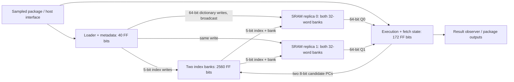
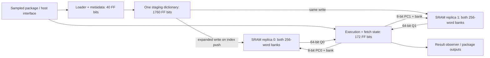
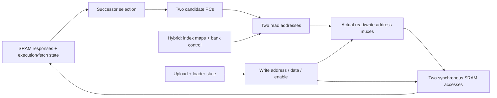

# From machine semantics to a chip organization

This study compares the existing hybrid and direct-SRAM chips without changing
their behavior or launching another physical experiment. The decision is to make
**state ownership, per-edge resource use and physical communication explicit**
before the next implementation change. Hybrid retains its mapped-area advantage;
direct remains a useful comparison because it removes most of the macro-address
logic. Neither is established as the better routed implementation.

[Architecture](architecture.md) owns the reusable design principles;
[research status](research/status.md) owns the next allocation. The
[selected measurements](../physical/experiments/chip-architecture-results.json)
and `build/validation/chip-architecture-02/report.json` record this September 21,
2026 comparison. The latter includes all input hashes, register owners, structural
dependencies, macro-port counts and checks against the previously simulated
Verilog. Existing physical receipts are preserved.

The state/interface and computational-map increments are complete.
`SramAssembly` supplies typed owners, SRAM interfaces and eight named
computations from the actual emitted expressions. `SramSchedule` connects their
read/write cuts to the existing controller. Every mapped combinational cell is
accounted for, including shared producers, and all four MLIR and RTL emissions
remain byte-identical. The [organization receipt](../physical/experiments/chip-organization-results.json)
records the checks and a rejected placement hypothesis: moving the final address
gates toward SRAM shortens their outputs but increases the estimated total span
of their incident nets. Retain the current placement and half corridor.

## The contract and the choices it leaves open

The comparison keeps the current accepted programs, 322-push upload protocol,
atomic replacement, immediate commit/start behavior, and exact pin/capture edges.
In particular, an instruction cannot gain a fetch bubble. Consecutive one-cycle
conditional branches are the demanding case; average instruction duration is not
a sufficient schedule argument.

| Obligation | What follows in these two implementations | What remains a design choice |
| --- | --- | --- |
| Restart the active program while an incomplete replacement exists | Retain active and staged image ownership simultaneously | Two fixed address banks are the current representation, not a universal storage lower bound |
| Choose a successor on the specified edge, including late branch decisions | Both possible records must already be available for the worst case | Two replicated single-port macros provide two independent reads; a different memory resource/schedule would need its own argument |
| Preserve every accepted upload edge | Direct expansion happens on the index push itself | Expansion during upload versus map lookup during execution |
| Execute 256 addresses using up to 32 distinct dictionary records | Both organizations retain this admission rule | Compressed indexed representation versus an expanded SRAM image |
| Safely reset and replace programs | Invalidate ownership and initialize reachable words before commit | Clearing entire SRAM arrays is unnecessary under the existing invariant |
| Preserve public observations | Internal reorganization must refine the same machine | Internal module boundaries, placement, duplicated combinational logic and encoding are not fixed by the proof decomposition |

Each macro contains **both atomic banks**. The second macro is a read replica,
not the inactive bank. Confusing these two kinds of duplication leads to an
incorrect area budget and an incorrect execution schedule.

## State ownership

All mapped flip-flops have an identified source register owner. `SramAssembly`
classifies the Lean register constructors and generates the same names and
widths used by emission; the analyzer no longer guesses owners from name
patterns. These remain conceptual blocks in the current flat netlist, not
newly implemented RTL modules.

| Owner and lifetime | Hybrid FF bits | Direct FF bits | Updates / consumers |
| --- | ---: | ---: | --- |
| Index maps: two 256×5 banks | 2,560 | 0 | Inactive-bank index pushes; two combinational execution lookups |
| Upload scratch: one 32×55 dictionary | 0 | 1,760 | Dictionary pushes; expansion during later index pushes; never execution storage |
| Per-bank idle/last metadata | 28 | 28 | Final two pushes; committed execution |
| Loader ownership and cursor | 12 | 12 | Begin/push/commit/abort/reset; selects and protects images |
| Current/start words and start-pending flag | 123 | 123 | Dispatch, commit/start bypass and restart |
| Execution, counters, pins and captures | 49 | 49 | Execution edges; fetch decisions and public/result observations |
| Input sampler | 12 | 12 | Package-pin sampling; serial receiver and engine |
| Serial receiver | 76 | 76 | Configuration transport; admitted loader commands/data |
| Result observer | 35 | 35 | Completion, host reads/consume/clear; does not update engine state |
| **Total mapped FF bits** | **2,895** | **2,095** | **335 common bits; 800-bit organization difference** |

The emitter declares 2,901 / 2,101 bits. The six-bit difference in both mappings
is precisely `r_cached_word[3:8]`: these named nets have no cells or loads in the
saved mapped JSON. The mapped census counts real FFs rather than treating every
surviving wire name as storage. Macro output registers are already inside the
macros; they are not another 128 external FFs.

For the diagrams, the shared execution/fetch state is 172 FF bits (49+123);
loader/metadata is 40; the sampler, serial receiver and result observer together
are 123. These sums explain the common 335 bits without hiding transport or
control in a percentage allowance.

Hybrid's critical organization is a combinational index lookup before each
synchronous dictionary access:



Direct's dictionary lookup occurs during upload. Execution addresses the expanded
image directly; staging scratch is outside the execution feedback loop:



Loader write addresses and write/read selection also reach the macros in both
diagrams. The port census below includes that shared selection logic. The
sampled engine inputs remain timing-sensitive even when configuration is idle.

## Complete resource schedule

All edges below are controller edges; the serial transport supplies commands
according to its existing schedule. Each single-port macro performs at most
one access per edge. `WEN` and `REN = !WEN` are exclusive, the write mask is full,
`MEN=1`, `A_DLY=1`, and BIST is disabled in `test/sram_chip.sv`.

| Phase / edge | Hybrid storage work | Direct storage work | Ownership / availability |
| --- | --- | --- | --- |
| Begin | Start staging | Start staging | Active image remains intact |
| Accepted pushes 0–31 | Write inactive dictionary word to both macros | Write one dense scratch word | No accepted upload while engine is busy |
| Accepted pushes 32–63 | Validate padding | Validate padding | No storage write for padding |
| Accepted pushes 64–319 | Write inactive 5-bit map entry | Read scratch combinationally, expand, write inactive program word to both macros | Exactly one index push per accepted edge; no later copy pass |
| Accepted pushes 320–321 | Write inactive idle/last metadata | Same | Image becomes complete under the existing loader rule |
| Abort / global reset | Invalidate ownership; retain arrays | Same; scratch may be overwritten on later staging | Stale words are not made executable by reset |
| Commit C | Select completed bank; port 0 reads its word 0 | Same, with direct addressing | New Q0 appears after C; it cannot be captured by another register on C |
| Immediate start C+1 | Bypass Q0 into execution and save it as the start word | Same | Decode entered word and issue both candidate reads on C+1 |
| Later start | Use retained start word | Same, independent of staging scratch | Both candidate reads occur on the start edge |
| Dispatch E | Select already available successor; map its two candidate PCs before E; latch SRAM responses after E | Same, without map lookup | Both alternatives are ready for E+1 |
| Consecutive branch E+1 | Select a candidate using the current branch decision; simultaneously request its next two candidates | Same | Repeats on every edge, including consecutive branches |
| Hold / wait | Repeat current candidate reads | Same | No extra execution interval is introduced |

The physical read enable is high on **every nonwrite edge**, including idle,
padding and metadata phases. A useful result is required only on the scheduled
execution/commit edges. Functional irrelevance at idle is not a power-saving
claim; no activity or energy measurement was made.

The hybrid schedule is tied to `SramController`, `SramContents` and
`SramExecution`'s existing closed-loop model proof. Both variants have the saved
11,840-edge core regression, including 1,000 consecutive branches and negative
controls. Direct expansion/request refinement and the full emitted-chip binding
remain separate proof obligations. The table describes the schedule; the
checked obligations below state its current formal boundary.

## Communication and area budgets

Counts below come from the same typical-corner, complete-chip mapping recipe.
They include the host result interface and configuration transport.

| Resource | Hybrid | Direct |
| --- | ---: | ---: |
| SRAM organization per read replica | 64×64 | 512×64 |
| Physical SRAM array bits, both replicas | 8,192 | 65,536 |
| Two macro footprints, µm² | 100,978 | 300,205 |
| Individual macro width × height, µm | 784.48 × 64.36 | 784.48 × 191.34 |
| Standard-cell area, µm² | 292,580 | 179,391 |
| **Total cells + macros, µm²** | **393,558** | **479,596** |
| Combinational cells | 12,593 | 6,781 |
| Actual instances including FFs and macros | 15,490 | 8,878 |

The original JSON census includes two `$scopeinfo` records in each design;
those records have no physical area. The original reported counts of
15,492 / 8,880 therefore remain correct as JSON record counts. Area figures do
not include placement whitespace, halos, clock trees or physical repair.

Direct saves 113,189 µm² of standard cells but adds 199,227 µm² of SRAM, for a
net mapped increase of 86,038 µm². A smaller gate graph alone does not win this
trade. The direct pair also occupies nearly three times the macro height.

| Macro boundary, both instances combined | Hybrid endpoint pins / distinct signal nets | Direct endpoint pins / distinct signal nets |
| --- | ---: | ---: |
| Address inputs | 12 / 11 | 18 / 17 |
| Write data inputs | 128 / 64 | 128 / 63 |
| Response outputs | 128 / 128 | 128 / 128 |
| Read enable | 2 / 1 | 2 / 1 |
| Write enable | 2 / 1 | 2 / 1 |

The bank-address bit is shared. Writes and enables are broadcasts. In direct,
one bit of each 64-bit write port is constant zero; its other 63 bits are distinct
signals. Dense 55-bit scratch does not imply a 55-wire expanded write interface:
the encoding selects different field positions. All 128 macro response bits have
loads in both saved designs. Clock, power, BIST and constant mask pins are excluded
from this signal table. These are pin/net counts, not wire length, toggles or
bits of independent information.

The decisive difference is **where the combinational dependencies live**:

| Structural cone, all operating modes | Hybrid cells / maximum cell depth | Direct cells / maximum cell depth |
| --- | ---: | ---: |
| Union of both macro address inputs | 6,037 / 29 | 607 / 21 |
| Broadcast write data | 0 / 0 | 999 / 11 |
| Both read/write enables | 106 / 14 | 93 / 12 |
| Execution register next values | 1,336 / 27 | 1,424 / 26 |

A cone traces backward through combinational gates and stops at FF Q, macro Q
and package inputs. Each gate is counted once within a union; rows overlap and
must not be added. Every input pin is conservatively treated as influencing
every output of its cell. Address cones include the upload mux and admission
logic; they are not phase-qualified execution paths or sensitized timing paths.

Hybrid's address cone reaches all 2,560 index-map FFs; direct's reaches no
scratch FF. Direct instead pays its dictionary lookup cost at the write-data
input during upload. In both designs the union of address cones reaches the same
21 bits of **each** macro response: kind bits 0–2, finish bits 41–42, and target
bits 47–62. Both response owners reach each address port. The two memories are
therefore coupled through shared selection and candidate decoding; treating
them as independent physical lanes would miss the feedback.

Maximum cell depth is not nanosecond delay. The saved slow pre-layout STA has
setup slack +10.26 ns for hybrid and +9.97 ns for direct at an assumed 20 ns
period; both have negative hold slack. Fewer address-cone cells does not establish
better timing. No routed direct comparison exists, and the hybrid's remaining
SRAM-body routing violations also involve flow/macro integration. These counts
do not establish the cause of those violations.

## Checked assembly and edge obligations

`Pinwheel/Hardware/Storage/SramAssembly.lean` owns the existing package
composition, register lists and labels previously in the test emitter.
`test/SramChipEmit.lean` serializes that shared description to MLIR and a small
JSON manifest. No second scheduler, extra register or hierarchy is introduced.

The manifest contains nine state owners and seven crossings: five request
signals before the macro edge and two response buses after it. Lean checks
the request interface's complete enumeration and unique names. The analyzer
binds the manifest to all named state and ten address/data/enable terminals
across the two macros, in both saved JSON and mapped-Verilog read-back. Hybrid
addresses have nine logical bits but six physical bits; discarded upper bits
must be constant zero. Missing writes, swapped responses, incorrect phases,
wrong widths and dynamic discarded bits are rejected.

`Pinwheel/Hardware/Storage/SramSchedule.lean` states thirteen digital obligations
using the existing controller expressions, array state and execution invariant:

| Obligation | Checked lemma(s) | Scope |
| --- | --- | --- |
| Exactly one read or write enable per edge | `one_access` | Both controller variants; includes idle reads |
| Both branch candidates are already available and remain so after each edge | `candidates_ready`, `candidates_after_edge` | Valid running hybrid state; no duration restriction |
| Q after the edge belongs to the actual pre-edge address, or holds on a write | `response_edge` | Hybrid array/controller model |
| Start refers to word zero of the valid active image | `start_ready` | Retained or bypassed hybrid start value |
| Commit marks Q0 for bypass, then saves that same value on the following edge | `commit_pending`, `commit_bypass`, `commit_saved` | Actual hybrid commit condition |
| Configuration cannot overwrite the active bank | `active_bank_untouched` | Every address of either hybrid replica |
| Every replica receives the actual data port on a write | `broadcast_write` | Enabled hybrid write |
| Read/write edges use the corresponding named address computation | `request_on_read`, `request_on_write` | Both variants; conditions are the actual write-port value |
| Running execution belongs to the read-edge envelope | `running_reads` | Hybrid; the envelope also includes idle and commit |

These lemmas reuse the established execution invariant; they do not assert that
the external Verilog macro implements the array model. Direct's execution proof,
full package composition/read-back, macro control constants and electrical timing
retain their separate obligations. The computational grouping below is checked
against artifacts; it is not another machine model or a physical timing proof.

## Computational map and phase cuts

The eight computations are successor selection, two candidate PCs, two read
addresses, upload address, upload data and write enable. `SramAssembly` applies
the existing input adapters to these controller expressions and locates them in
the actual emitter cache. A probe that would add an operation is rejected.
There are no new observation ports, registers or pipeline edges.



This diagram omits shared control arrows; the report retains every conservative
root dependency. Direct uses the candidate PCs without a map lookup. A source
computation frontier stops at another named computation, so a shared successor
is not silently described as two independent decoders.

| Address computation, union of both ports | Hybrid source operations | Direct source operations |
| --- | ---: | ---: |
| All edges, including write selection | 1,312 | 260 |
| Read branch, assuming actual write enable is zero | 1,239 | 185 |
| Write branch, assuming actual write enable is one | 4 | 4 |

These are **unoptimized emitted operations**, not the mapped-cell counts above.
Bit-position propagation handles slices, concatenation and subtraction carries;
muxes retain both arms unless the specific read/write cut is applied. Read
addresses retain four serial-receiver control bits but exclude its 64 payload
bits. Hybrid still reaches all 2,560 map bits, while direct reaches no scratch
bits. The read envelope includes idle, commit and non-SRAM upload edges; it is
neither a running-only timing path nor permission to declare an STA false path.

Mapped logic is grouped by its actual sequential/package consumers. FFs retain
typed owners; macros belong to fetch. Address logic is fetch, upload data logic
is configuration, transport/result logic is interface, and a producer serving
multiple regions is shared. Every cell is counted once:

| Consumer region | Hybrid combinational cells | Direct combinational cells |
| --- | ---: | ---: |
| Fetch, including map updates and both SRAM address trees | 12,094 | 1,613 |
| Configuration | 83 | 4,736 |
| Interface | 224 | 225 |
| Shared across regions | 192 | 207 |
| Unused | 0 | 0 |

The corresponding cuts cross 255 / 335 distinct nets, including external
connections and reset but excluding clocks and constants. Sink-pin counts are
reported separately from nets. These counts describe this grouping, not an
improvement over another placement. **A single hybrid fetch region contains 96%
of the combinational logic**, so it is too broad to be a useful locality rule.
Consumer sets in the full report retain finer distinctions between map updates,
each address port and shared execution logic.

## A cheap test rejects the first locality projection

The first concrete hypothesis was to pull only the final three private address
stages toward their corresponding SRAM pins. Selection walks actual connectivity,
stopping at state, shared producers and the depth bound; buffers and delay cells
count as stages. Physical synthesis renames nearly all cells and retains six
more FFs than the typical mapping. Therefore the analyzer selects anew from the
saved OpenDB connectivity instead of transferring mapped cell names.

The saved `hybrid-chip-15` global-routing database supplies these measurements:

| Selected address stages | Replica 0 | Replica 1 |
| --- | ---: | ---: |
| Cells in final three private stages | 36 | 34 |
| Cell footprint, µm² | 379.210 | 353.808 |
| Incoming nets per group | 58 | 51 |
| Mean cell-center distance to address-pin envelope, µm | 314.021 | 182.863 |

Together these are 70 cells, 100 distinct incoming nets (nine shared between
groups), and 170 incident signal nets including internal/output connections.
Using five stages would select 363 cells; eight would select 3,573. Merely
expanding the selection is not a small placement change.

The [candidate windows](../physical/experiments/sram-address-locality.json) use
existing rows above each SRAM: `[540,120.96,751.68,132.3]` and
`[540,219.24,751.68,241.92]` µm. Both avoid the macros and reserved strip.
The cheap screen clamps selected cell centers into those windows, holds other
cells fixed, and sums each incident net's bounding-box half perimeter once.
Standard-cell centers and macro/package pin-envelope centers approximate its
endpoints. Projected cells may overlap; no placement or routing is performed.

| Projection | Baseline net-span sum, µm | Projected sum, µm | Change |
| --- | ---: | ---: | ---: |
| Replica 0 group alone | 11,700.520 | 22,946.680 | +96.1% |
| Replica 1 group alone | 7,690.010 | 13,197.470 | +71.6% |
| Both groups, distinct nets counted once | 18,503.610 | 34,161.030 | **+84.6%** |

None of the 70 individual projections improves that same estimate with its
neighbors fixed. The cost moves upstream: shorter final address connections
do not compensate for longer incoming connections in this screen. **Defer this
projection before spending on placement.** This does not prove every possible
placement in those windows is worse, nor determine a timing-weighted optimum.
It supplies no new explanation for the separate SRAM-body Metal4 violations.

The follow-up [map-slice study](map-slice-study.md) now includes the source state
and lookup logic whose connections would otherwise be stretched. Its complete
bit plane has 512 FFs, 1,986 private gates and 1,073 incoming nets. It also checks
16-word groups against the actual read-tree ordering. These remain costed graph
partitions, not independently proved physical blocks.

## The structural next step

The shared assembly now links state, computations, edge obligations and mapped
consumers, with typed bank/word coordinates for slice analysis. The next
increment is a [16-entry tile with local decoding](map-slice-study.md#the-next-concrete-implementation-experiment),
using strided entries that match `readTree`. Prove its read/update contract,
then check whether the intended compact interface survives mapping at acceptable
cost. Keep the existing loader, `FetchPolicy`, feeders and observer.

A placement candidate must first pass this geometric screen or have an explicit
timing-based reason for accepting more wire. Then use one bounded placement and
global-routing comparison with fixed macro locations and the verified corridor.
Require legal cells/rows, the intended grouping, preserved pin access, and
comparable congestion, buffering/hold-repair area and timing from the same stage.
Only a useful coarse result earns detailed routing. The regional Metal4 capacity
experiment remains a separate, deferred flow diagnostic.

Reproduce the checked map and the rejected projection with a fresh tag:

```sh
python3 -B scripts/report-chip-architecture.py --tag NAME \
  --placed-context build/validation/chip-organization-01/global-15-context.json \
  --placed-database build/physical/hybrid-chip-corridor-half/runs/hybrid-chip-15/01-openroad-globalrouting/tt_um_pinwheel.odb \
  --locality-windows physical/experiments/sram-address-locality.json
```

The optional placed inputs require exact database, exporter and helper hashes;
the default report needs only the prior SRAM comparison. The export was refreshed
read-only in 2.810 s, reproducing geometry/connectivity exactly; its container's
absence was verified. All previous receipts and the first rejected provenance
check are retained. The selected receipt records the final gate and focused
tests. This increment runs no synthesis, RTL simulation, placement or routing.

This interpretation follows Jane Street's examples of typed reusable interfaces,
explicit hardware pipelines and resource sharing in
[Advent of Hardcaml](https://blog.janestreet.com/advent-of-hardcaml-2024/).
The appropriate lesson here is to model the hardware allocation deliberately;
Pinwheel's externally fixed edges restrict where a pipeline may be inserted.
CIRCT separately represents dependencies, operator resources and schedule
verification in its [scheduling infrastructure](https://circt.llvm.org/docs/Scheduling/).
OpenROAD's [hierarchical macro placer](https://openroad.readthedocs.io/en/latest/main/src/mpl/README.html)
uses hierarchy/dataflow information. These are supporting design patterns, not
evidence that these tools have optimized Pinwheel or a requirement to replace Lean.

## Reproduction and evidence boundary

```sh
python3 -B scripts/report-chip-architecture.py --tag chip-architecture-next
python3 -B -m unittest discover -s test -p test_chip_architecture.py -v
```

Use a fresh tag; existing directories are refused. The default input is the saved
`build/storage/sram-chip/corridor-02` comparison. The gate verifies its macro
wrapper and pinned CIRCT/Yosys identities, builds the current Lean library and
emitter, runs the whole-library axiom audit and `Interfaces` checks, then emits
both assemblies. All four MLIR and RTL artifacts must equal that comparison's
hashes before current ownership can be applied to its saved mappings. A source
refactor is therefore permitted; a hardware change requires a new comparison.

The pinned Yosys only reads the receipt-hashed mapped Verilog into a second
graph. Every named sequential input and package port must have the same
structural signature as saved JSON, allowing automatic cell names and bit
identifiers to differ. Saved black-box declarations supply port shapes. The
typed register and crossing manifests must match both graphs. This is a checked
artifact-consistency boundary, not a technology-mapping equivalence proof.

The organization gate in `build/validation/chip-organization-check-03/report.json`
took **15.110 seconds** on this host: 13.168 s for cached Lean checks and
emission/export, then 1.942 s for analysis/read-back and projection. The audit
covers 14,479 declarations and 7,393 theorems using standard axioms only. All
21 focused Python tests pass, including computation/phase/bit-position checks,
shared ownership, invalid graph controls, and a geometry example where shorter
outputs are outweighed by longer inputs. The earlier assembly gate and its
13-test receipt remain in `sram-assembly-check-02`.

`chip-organization-check-01` passed Lean/emission/read-back but rejected an old
geometry-helper identity. Refreshing the export changed only that hash, not any
geometry or connectivity. `chip-organization-check-02` then completed the map;
the final `-03` receipt also includes the reproducible projection screen.
The subsequent `map-slice-check-01` gate adds typed map coordinates and the three
slice budgets with 30 focused tests; its receipt and limits live in the
[map-slice study](map-slice-study.md#reproduction-and-limits).

The earlier census in `chip-architecture-02` took 1.793 s with nine tests and all
220 then-current comparison sources unchanged; that historical receipt is
preserved alongside `chip-architecture-01`. The assembly refactor changes the
library entry point and test emitter while preserving emitted artifact bytes.
No new synthesis, RTL simulation, placement or routing was performed. These checks
can reject bad organizational assumptions cheaply; they cannot replace extracted
timing, antenna/layout checks or final chip qualification.
