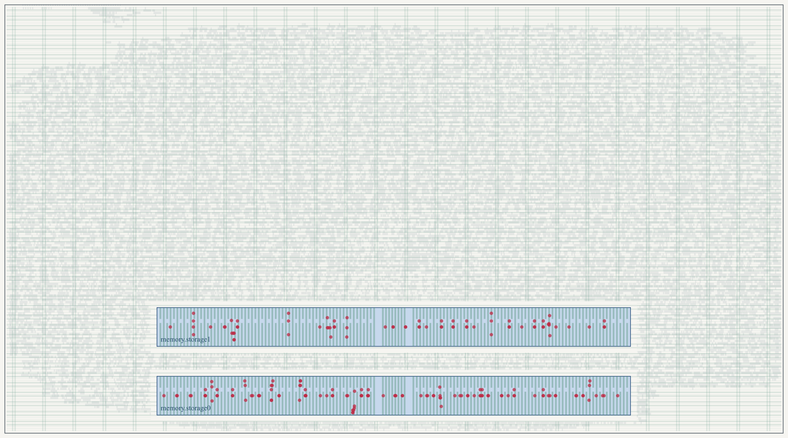
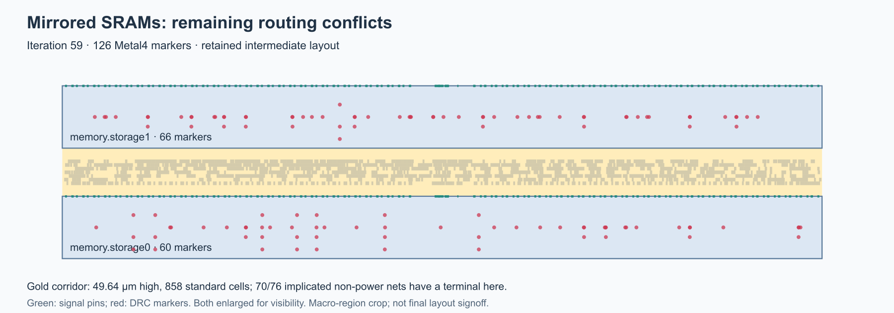
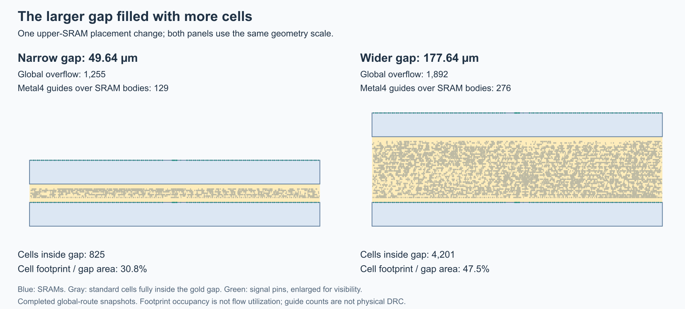
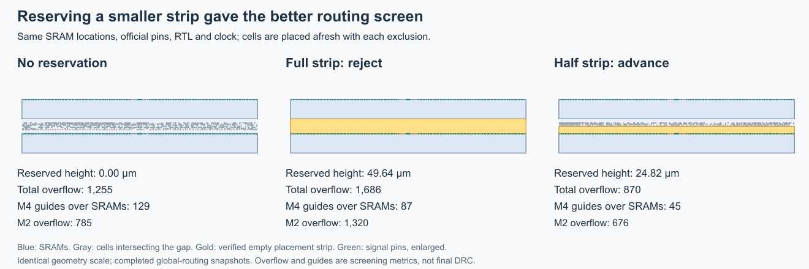

# First whole-chip SRAM physical experiment

This experiment applies the official 6×4 pin template to `tt_um_pinwheel`, with
serial upload, samplers, the result mailbox and two hybrid SRAM macros. The
[storage comparison](storage-primitives.md#complete-chip-comparison-2026-09-19)
owns the earlier mapped-area screen. This page owns physical integration and
the limits of its results; [status](research/status.md) owns the next decision.

The [exact-mapping comparison](#exact-mapping-placement-and-hold-repair--september-22)
preserves the chosen cell netlists through physical intake. Its area advantage
survives placement and repair. The
[clock-budget follow-up](#clock-budget-and-post-routing-repair--september-22)
clears the measured hold failures and most clock fanout violations at an area
cost. The latest [local repair diagnosis](#local-clock-and-sram-repair--september-22)
identifies the ineffective optimizer's missing layer RC initialization and
validates an eleven-buffer repair before another route. Earlier attempts below
remain historical evidence under their recorded configurations.

## Frozen boundary

`physical/chip.json` and `physical/chip.sdc` are separate from the historical
core configuration. The die is 1,289.28 × 710.64 µm, with the pinned
`tt_block_6x4_pgvdd.def` and its 43 Metal4 pins. The period is 20 ns; external
input/output delays are 4 ns maximum and 0.2 ns minimum, clock uncertainty is
0.2 ns, transition is 0.15 ns, and output load is 0.010 pF. These are declared
digital boundary assumptions, not board or analog synchronizer guarantees.

Preparation consumes a completed, source-matching SRAM comparison. It freezes
the exact hybrid RTL, Verilog binding, macro interface, GDS, LEF, CDL and three
Liberty views. Downloads must match the pinned PDK Git inventory; the shared
PDK installation is mounted read-only. Execution snapshots every prepared view,
constraints and receipts, verifies the container/PDK identity and preserves
failed runs. Each invocation has four CPUs, 6 GiB RAM and a wall-time limit.

The public SRAM example connects both `VDD!` and `VDDARRAY!` to the supply and
`VSS!` to ground. Pinwheel adopts those explicit connections, while retaining
its own flow checks. See the [example configuration](https://github.com/urish/ttihp-sram-test/blob/main/src/config.json).
Signal routing stops at Metal4. The experimental two-layer power grid uses
TopMetal1 to access SRAM power pins; shuttle grid compatibility still needs
qualification. Fast screening combines −40 °C standard cells with the only
pinned fast SRAM view, at −55 °C. It is not a matched-temperature signoff corner.
KLayout DRC/XOR remain disabled as in the pinned core flow; Magic checks remain
enabled. No blanket signoff claim follows from the configuration.

## Integration results

An initial lint attempt exposed the need for the macro's black-box interface;
preparation now extracts that interface from the pinned vendor model, retaining
its license/header. The three subsequent complete attempts used identical RTL:

| Attempt | Change | Global routing overflow | Outcome |
| --- | --- | ---: | --- |
| `hybrid-chip-02` | Middle macro placement, density 60%, default horizontal power pitch | 3,382 | Global routing stopped; SRAM array supply disconnected |
| `hybrid-chip-03` | Power pitch 16 µm, density 50% | 5,021 | Supply connectivity check passed; global routing stopped |
| `hybrid-chip-04` | Both macros near bottom, same grid/density | 1,668 | Supply connectivity check passed; global routing stopped |

The 50 µm power pitch could miss a macro's roughly 19 µm high array-supply
region. Reducing pitch cleared the reported power-grid violations. This is a
connectivity result, not IR-drop/electromigration or foundry qualification.
Moving macros reduced overflow by 66.8% relative to the preceding attempt, but
did not eliminate it. Density and grid changed together in attempt 03, so their
individual routing effects were not isolated.

Before routing, attempt 04 has 483,185 µm² of instances, including 100,978 µm²
of macros. The flow synthesized 411,203 µm² before placement/repair; that recipe
differs from the earlier 393,558 µm² ABC comparison. Repair buffers alone occupy
64,226 µm². The earlier 422,816–452,074 µm² allowance was too optimistic for this
flow. Macro area savings are real, but routed cost includes a large clock and
hold-repair bill plus congested connections to the remaining flip-flop maps.

Its latest completed mid-placement typical-corner estimates are +11.20 ns setup
and +0.23 ns hold, with three slew and 209 fanout violations. The state file also
inherits earlier fast/slow metrics: those are **not current extracted timing**.
No final DRC, LVS, antenna or all-corner timing result exists at this stage.

The exported attempt-04 netlist after clock/hold repair passes the fresh
508,252-edge external-pin regression, and a compiled output corruption fails it.
This adds functional evidence for the repaired netlist, distinct from the earlier
ABC-mapped comparison. The receipt records its actual netlist view and does not
claim that later physical states necessarily export a new netlist.

The bounded continuation, `hybrid-chip-05`, resumed the verified attempt-04
checkpoint with `GRT_ALLOW_CONGESTION=true`. It hit its 2,700-second wall limit
during detailed routing; the container was confirmed stopped. The last complete
step-log iteration reports **168 violations**, and detailed routing did not
finish. Allowing global congestion therefore did not establish closure within
this budget. It did not relax detailed-route DRC or the final acceptance gate.

The last completed state is the STA step preceding detailed routing, after
antenna-diode insertion: 483,806 µm², estimated typical setup/hold +7.58/+0.04 ns,
24 slew, 222 fanout and 14 capacitance violations. Fast/slow entries are inherited
from older states. There is no completed detailed-route database, extracted
multi-corner timing or final DRC/LVS result. The zero antenna count at global
routing is not a final antenna signoff result.

The [tracked result manifest](../physical/experiments/hybrid-chip-physical-results.json)
binds configurations, RTL, reports and functional checks. Full logs remain under
`build/physical/`; the timed-out attempt has a completed failure receipt, not a
success receipt. Its step log preserves iteration summaries, but detailed-route
snapshots/per-iteration geometry reports were disabled. The following diagnosis
adds those artifacts so a timeout leaves inspectable violation locations.

## Routing diagnosis (2026-09-19)

`hybrid-chip-06` resumes the verified pre-detailed-route checkpoint from attempt
05, with the same RTL, placement, package pins and 20 ns constraint. The only
configuration changes enable per-iteration OpenDB snapshots and DRC reports.
The run was deliberately stopped after its geometry made the failure actionable;
Docker confirmed termination and the runner recorded exit 137. This is a
diagnostic stop, not routing completion or a wall-time timeout.

The last completed iteration, 38, has **196 markers: 141 shorts and 55 spacing
violations, all on Metal4 and fully inside the two SRAM footprints**. Of these,
136 involve power or ground; ten involve clock nets. These are router markers,
not counts of independent root causes or final foundry DRC results. Earlier
Metal2/Metal3 conflicts cleared in this attempt. The corresponding snapshot,
report and log agree on the iteration/count. The classification under
`build/physical/diagnosis/baseline-final/` records hashes and paths for those originals.



Red dots mark the reported violations, enlarged for visibility. Blue rectangles
are SRAM footprints; green stripes within them are their supply-pin shapes.

The macro geometry explains the local obstacle: each SRAM contains fixed
vertical Metal4 supply rails, while all 342 signal-pin shapes are on Metal2
along its bottom edge. The marker rectangles overlap the macro interior,
including signal routes crossing supply rails. The existing global guide file
contains 470 Metal4 guide rectangles overlapping the macro footprints, belonging
to 228 nets. Guide rectangles are coarse routing regions, not actual wire shapes.
This localizes the current failure; it does not establish that index-map wiring
or repair cost is harmless, or that a different floorplan will necessarily close.

The controlled follow-up adds only two Metal4 signal-routing obstructions over
the macro footprints, exempting power nets. `scripts/routing_keepouts.py` verifies
the input checkpoint, rejects macros with signal pins on the obstructed layer,
checks unchanged instance placement/connectivity, round-trips the output database
and captures a separate checkpoint/derivation receipt. Vendor macro views and
the base chip profile stay unchanged. The resulting experiment is not promoted
into the normal flow merely by producing a new checkpoint.

The tooling separates three jobs: `routing_context.py` exports geometry and
connectivity from a retained OpenDB; `diagnose-routing.py` matches a DRC report
to the same snapshot iteration and completed log count, then writes a JSON
summary and annotated SVG/HTML; `routing_keepouts.py` creates the isolated
implementation experiment. The standard physical reporter can now record a
timeout in the first resumed step without inventing a completed step: its
metrics are explicitly inherited from the verified input checkpoint.

The follow-up, `hybrid-chip-07`, was stopped after reaching the same comparison
iteration. **The keepout-only change did not improve the result and is not
adopted.** Both containers were independently confirmed absent afterward.

| Iteration 38 | Baseline | Metal4 keepouts |
| --- | ---: | ---: |
| Router markers | 196 | 240 |
| Shorts | 141 | 236 |
| Spacing violations | 55 | 4 |
| Markers intersecting SRAM footprints | 196 | 240 |
| Markers involving power/ground | 136 | 118 |

All markers in both reports are on Metal4. The global-route guides are
byte-identical, including the 470 rectangles overlapping the macros on 228 nets;
only 90 of these nets connect directly to a macro terminal. This is broader than
an isolated pin-access failure. Both runs retain the 1,668 global overflow of the
earlier attempt. The follow-up's last completed state still reports 483,806 µm²
and typical pre-route setup/hold estimates of +7.58/+0.04 ns. It has no completed
detailed-route state, extracted multi-corner timing, or final layout checks.

These results motivated a floorplan and global-guide experiment, starting before
placement/clock repair: test signal pins facing the surrounding logic, preserve
space around the blocked macro bodies, and regenerate the guides. The orientation
screen below checks guide overlaps and congestion before allocating another
detailed-routing budget. The diagnosis alone does not justify replacing hybrid
with larger direct SRAMs or restricting the UART execution contract.

Use `physical/experiments/routing-diagnostics.json` with the runner's
`--overrides` option to retain routing snapshots. The pinned tool writes snapshots at
the detailed-routing step root while a routing pass is active, then moves them
into `drt-run-N` on completion. Intermediate reports are named
`tt_um_pinwheel.drc-ITER.rpt`. Export and diagnose matching iterations only.

## Orientation experiment (2026-09-19)

The pinned macro LEF permits X/Y mirroring. `hybrid-chip-08` starts a complete
fresh flow with both macros mirrored vertically (`FS` in the configuration,
`MX` in OpenDB), keeping their lower-left positions fixed. The actual placed
boxes are unchanged, and all 342 signal-pin shapes per macro now lie along its
top edge. Exact comparison confirms unchanged package-pin geometry, RTL, macro
views, clock boundary, power-grid parameters and all other flow controls.

The experiment is staged separately under `build/physical/hybrid-chip-north/`.
`physical_floorplan.py` permits only the locations/orientations of existing
instances to change; staging records that derivation, and the runner checks it
against the base profile on fresh and resumed runs. The default profile retains
its original placement. This avoids editing a repaired database in place or
reusing its old placement/timing as evidence for the new orientation.

The screen stops after global routing, before the long detailed-routing step.
Compared with the baseline's same global-routing stage:

| Global-routing screen | Baseline, pins south | Mirrored, pins north |
| --- | ---: | ---: |
| Total overflow | 1,668 | 1,255 |
| Metal2 overflow | 566 | 785 |
| Metal3 overflow | 344 | 262 |
| Metal4 overflow | 758 | 208 |
| Metal4 guide rectangles overlapping macro bodies | 470 | 129 |
| Nets represented by those rectangles | 228 | 94 |
| Of those nets, directly connected to a macro | 90 | 52 |
| Instance area after placement/repair, µm² | 483,185 | 483,417 |
| Timing-repair buffer area, µm² | 64,226 | 64,128 |
| Global-route estimated wire length, µm | 1,783,915 | 1,869,386 |
| Reported power-grid connectivity violations | 0 | 0 |

Total overflow improves by 24.8% and Metal4 overflow by 72.6%. Metal2 overflow
increases, and estimated wire length grows by 4.8%: the change redistributes
routing demand and does not eliminate congestion. Guide rectangles overlapping
macro bodies fall by 72.6% on Metal4; they remain coarse regions, not counts of
physical shorts. The new
`report-routing-guides.py` verifies that guide, context and database belong to
the same completed step, uses the database's actual coordinate scale, and
retains the artifact hashes. It rejects malformed/empty guides and unknown nets.

Typical pre-route setup/hold estimates are +11.02/+0.25 ns, with zero reported
slew/capacitance and 210 fanout violations. Fast/slow metrics in that state are
inherited, and the macro/grid qualification boundaries above still apply.
This screen justified the bounded `hybrid-chip-09` continuation, resuming its
verified checkpoint at `OpenROAD.CheckAntennas`, with snapshots enabled, four
CPUs, 6 GiB RAM and a 2,700-second wall limit. Its detailed-routing outcome is
recorded separately from this completed global-routing screen.

The continuation reached that limit and exited 124; the runner confirmed it
stopped, and an independent Docker query confirmed the container absent.
The last completed logged iteration is 59, with **126 markers**: 90 shorts and
36 spacing violations, all on Metal4. Snapshots/reports 60 and 61 also exist,
but their iteration completions are not present in the retained step log;
the diagnosis deliberately uses the matched iteration-59 snapshot/report.
Detailed routing and extracted timing did not complete.

| Matched iteration 38 | Baseline | Mirrored |
| --- | ---: | ---: |
| All markers | 196 | 174 |
| Shorts / spacing | 141 / 55 | 131 / 43 |
| Markers involving power/ground | 136 | 120 |

This is an 11.2% reduction at the same iteration. The later 126-marker result
used more iterations and is not the matched comparison. At iteration 59 all
126 markers are fully inside macro footprints: 60 in `storage0`, 66 in
`storage1`; 84 involve power/ground and two involve clock nets. Of the 76
distinct implicated non-power nets, 70 have a standard-cell terminal in the
49.64 µm gap between the macros. That gap contains 858 standard-cell instances;
28 of the 76 nets connect directly to a macro. These counts come from the
matching iteration snapshot, including the preceding diode insertion.



The next hypothesis was to increase separation between the two north-facing
macros, then repeat placement/clock repair and compare gap occupancy, macro-body
guide overlaps, per-layer overflow, wire length and repair cost. The terminal
concentration supported testing corridor access without establishing a unique
root cause. The following screen tests that hypothesis under the same capacity,
pins and clock boundary.

After antenna repair inserts 231 diodes, the continuation's last completed STA
step reports typical setup +8.409 ns, hold −0.611 ns, 16 hold violations,
67 slew, 30 capacitance and 229 fanout violations. Instance area is 484,675 µm².
These remain pre-detail-route estimates, and the inherited fast/slow metrics
are not current extracted results. Thus improving the routing markers alone
would not close the electrical/timing gates. The netlist view inherited by this
state is byte-identical to the post-CTS view already checked by
`orientation-repaired-03`; it does not describe the later diode-insertion ODB.

The [manifest](../physical/experiments/hybrid-chip-physical-results.json) binds
the screen, both matched diagnoses, final geometry, stopped-run receipts and
current validation. The interactive local diagnosis is
`build/physical/diagnosis/orientation-final/index.html`.

Reproduce the orientation screen after a source-matching comparison:

```sh
python3 scripts/prepare-chip-physical.py \
  --comparison build/storage/sram-chip/NAME/report.json --design chip-north-NAME \
  --macro-placement physical/experiments/sram-pins-north.json
python3 scripts/run-physical.py --design chip-north-NAME --tag chip-north-NAME \
  --pdk-root /path/to/installed/pdk --to OpenROAD.GlobalRouting \
  --overrides physical/experiments/routing-diagnostics.json --timeout-seconds 1800
```

## Wider-gap screen (2026-09-19)

`hybrid-chip-10` tests that hypothesis in a separate prepared design. Both SRAMs
still face north; only the upper instance moves, from `(252, 144)` to
`(252, 272)` µm. The gap grows from 49.64 to 177.64 µm. The 128 µm displacement
is eight horizontal power-grid pitches, preserving the macro's grid phase.
Fresh placement, clock repair and global routing regenerate the layout. The
RTL, macro views, 43 official signal-pin shapes, die, clock boundary, density
and grid parameters are unchanged. Actual power shapes change around the moved
macro, so this is not a claim of identical power geometry.

The flow exits 0 at the requested global-routing stop. The screen compares the
same completed stage with the narrow, north-facing configuration:

| Global-routing screen | Narrow gap | Wider gap |
| --- | ---: | ---: |
| Total overflow | 1,255 | 1,892 |
| Metal2 / Metal3 / Metal4 overflow | 785 / 262 / 208 | 899 / 513 / 480 |
| Metal4 guide rectangles overlapping SRAM bodies | 129 | 276 |
| Nets represented by those rectangles | 94 | 198 |
| Estimated wire length, µm | 1,869,386 | 2,349,619 |
| Standard cells fully inside the gap | 825 | 4,201 |
| Their footprint / rectangular gap area | 30.8% | 47.5% |
| Instance area after repair, µm² | 483,417 | 483,403 |
| Timing-repair buffer area, µm² | 64,128 | 64,016 |
| Reported supply-connectivity violations | 0 | 0 |



Overflow worsens by 50.8%, wire length by 25.7%, and overlapping Metal4 guides
more than double. The extra space attracts more cells; its footprint occupancy
also rises. These counts exclude cells straddling the gap boundary and are not
the flow's utilization metric. Occupancy and guide overlap do not establish a
unique cause of detailed-routing failure.

**Reject this separation-only candidate at the screen.** No detailed route is
allocated, and neither it nor the earlier orientation experiment changes the
base profile. The next bounded discriminator is to reserve a routing corridor
through placement exclusion, then regenerate placement and global guides.
Confirm that the exclusion is honored after repair and compare congestion,
wire length, guide overlap and repair area before allocating a long route.
Another unconstrained separation sweep is not justified by this result.

The wide-gap typical pre-route estimates are setup +10.380 ns / hold +0.254 ns,
with two slew, zero capacitance and 207 fanout violations. They precede antenna
repair and detailed routing. The earlier narrow continuation's post-antenna
hold/electrical failures remain a separate gate; neither these estimates nor
the completed screen establish routed timing or signoff.

The new repaired netlist passes all 508,252 independent external-pin edges,
and a compiled output corruption is rejected. The checked view is explicitly
`37-openroad-resizertimingpostcts/tt_um_pinwheel.nl.v`, inherited by the
global-routing state. This is zero-delay functional evidence for those exact
netlist bytes, not a new export of the global-routing database or routed timing.
The fresh SRAM comparison also passes all three implementations at RTL and both
mapped corners; proof additions leave the frozen hybrid RTL byte-identical.

The frozen experiment is `physical/experiments/sram-wide-gap.json`; its verified
comparison and input hashes are in
`build/physical/hybrid-chip-widegap/diagnosis/gap/comparison.json` and the
[physical manifest](../physical/experiments/hybrid-chip-physical-results.json).
Use the orientation-screen commands above with the new placement file and fresh
design/run names to reproduce it.

## Reserved-corridor screens (2026-09-21)

Two fresh screens reserve placement space within the original 49.64 µm gap,
with both SRAMs still north-facing at the attempt-08 locations. The pinned
flow's `FP_OBSTRUCTIONS` creates hard placement blockages **before rows are
created**, removing legal cell sites. Signal routing remains allowed there.
A [soft placement blockage](https://openroad.readthedocs.io/en/latest/main/src/odb/README.html#create-blockage)
applies only during initial placement, so it would not supply the same protection
against later repair insertion. `physical_floorplan.py` validates the rectangles;
preparation freezes them, and the runner reconstructs and checks the derivation.
No custom floorplan plugin or vendor-view change is needed.

The full strip is `(252, 94.36)–(1036.48, 144)` µm. The half strip ends at
`y=119.18`, reserving 24.82 µm next to the lower SRAM's north-facing signal pins.
Only `FP_OBSTRUCTIONS` differs from the orientation baseline's configuration.
The SRAM boxes, all 43 package signal-pin shapes, RTL, views, die, clock and
grid parameters match; power geometry regenerates with placement.

| Completed global-routing screen | No exclusion, 08 | Full strip, 11 | Half strip, 12 |
| --- | ---: | ---: | ---: |
| Total overflow | 1,255 | 1,686 | **870** |
| Metal2 / Metal3 / Metal4 overflow | 785 / 262 / 208 | 1,320 / 284 / 82 | **676 / 124 / 70** |
| Metal4 guides overlapping SRAM bodies | 129 | 87 | **45** |
| Nets represented by those guides | 94 | 71 | 41 |
| Of those nets, connected directly to a macro | 52 | 70 | 30 |
| Estimated wire length, µm | 1,869,386 | 1,884,556 | 1,836,756 |
| Instance area after repair, µm² | 483,417 | 483,526 | 483,381 |
| Timing-repair buffer area, µm² | 64,128 | 64,286 | 64,154 |
| Supply-connectivity violations | 0 | 0 | 0 |
| Typical setup / hold estimate, ns | +11.023 / +0.250749 | +10.765 / +0.254987 | +10.966 / +0.249275 |
| Slew / capacitance / fanout violations | 0 / 0 / 210 | 0 / 0 / 209 | 0 / 0 / 207 |



Both screens finish at the requested global-routing stop within their separate
30-minute caps. The full strip is rejected: lower Metal4 demand accompanies a
large Metal2 increase. The half strip qualifies for the single 90-minute
continuation: total overflow falls 30.7%, overlapping Metal4 guides fall 65.1%,
and wire length falls 1.7%, with essentially unchanged cell/repair area.
This is a local comparison of two candidates, not an optimal-width claim.

The screen gate requires at least 20% lower overflow, fewer overlapping M4
guides, at most 5% higher instance/repair area, at most 10% more wire, zero
supply violations and no regression in electrical violations or whether timing
constraints are met. Positive slack margins themselves shrink slightly for the
half strip, as shown above. These same-stage typical estimates are not extracted
timing; fast/slow metrics inherited from earlier states are not current checks.

`routing_context.py --placement-exclusions FILE` checks actual rows, hard
blockages and every instance with positive-area overlap, including boundary
straddlers. Both reservations have **zero overlapping rows or cells after
legalization, post-CTS repair and global routing**. The full strip temporarily
has 110 straddling instances at global placement, before legalization; those
are removed by the legal placement stage. The half strip also stays empty after
the continuation's antenna repair. This verifies the intended geometry without
mistaking intermediate global placement for a legal final placement.

Configurations are `physical/experiments/sram-corridor.json` and
`sram-corridor-half.json`. The frozen comparison is
`build/validation/corridor-cycle-01/screen-comparison.json`, with each inspected
database and geometry report retained under its prepared design. The tracked
[manifest](../physical/experiments/hybrid-chip-physical-results.json) binds those
receipts and the continuation separately.

To reproduce a screen, add the exclusion to the existing preparation command:

```sh
python3 scripts/prepare-chip-physical.py \
  --comparison build/storage/sram-chip/NAME/report.json --design corridor-NAME \
  --macro-placement physical/experiments/sram-pins-north.json \
  --placement-exclusions physical/experiments/sram-corridor-half.json
python3 scripts/run-physical.py --design corridor-NAME --tag corridor-NAME \
  --pdk-root /path/to/installed/pdk --to OpenROAD.GlobalRouting \
  --overrides physical/experiments/routing-diagnostics.json --timeout-seconds 1800
```

The checkpoint CLI now accepts `--design PATH`, so capture/verification can use
these prepared designs rather than assuming the historical `core` directory.

## Corridor continuation (2026-09-21)

`hybrid-chip-13` resumes the verified half-strip global-routing checkpoint at
`OpenROAD.CheckAntennas`, under the one allocated 5,400-second cap, four CPUs
and 6 GiB. It reaches that limit during an antenna-repair reroute and records
exit 124. The runner confirms termination; an independent Docker query then
confirms attempts 11, 12 and 13 are all absent. No extra physical run is
allocated in this cycle.

The matching first-pass comparison shows a measurable improvement:

| First routing pass, iteration 59 | No reservation, 09 | Half strip, 13 |
| --- | ---: | ---: |
| Router markers | 126 | **92** |
| Metal4 / Metal3 markers | 126 / 0 | 90 / 2 |
| Markers involving power/ground | 84 | 67 |
| Markers involving clock nets | 2 | 4 |

Total markers fall 27.0% at the same pass/iteration, although the clock-net
subset grows. Iteration counts describe optimization stages, not equal elapsed
time or independent root causes. The new first pass eventually completes
iteration 64 with **73 markers**, all fully inside the SRAM footprints: 68 on
Metal4 (61 shorts, seven spacing) and five Metal3 shorts. Twenty-seven lie in
`storage0`, 46 in `storage1`; 58 involve power/ground and four involve clocks.
The five Metal3 markers report signal routes crossing macro obstructions across
the macro height. They include address, Q and clock nets. Of 59 implicated
non-power nets, 46 connect to cells in the unreserved part of the gap. This is
geometry/connectivity evidence, not a unique causal explanation.

After that pass, the antenna check finds **49 violating nets and 55 pins**.
Repair adds 82 antenna cells, bringing the total from 166 to 248, then starts
`drt-run-1`. The complete outer log reaches iteration **38 with 198 markers**,
confirmed by its matching report. The shorter per-step log ends at iteration
35 with 230 markers: 221 Metal4, seven Metal3 and two Metal2. The retained
iteration-35 geometry has 225 markers inside SRAMs and five within 5 µm; those
receipts remain valid for that earlier snapshot. This interrupted repair pass
is neither the first pass's final result nor a matched comparison with attempt
09. Attempt 13 does not complete detailed routing, its antenna loop, extracted
timing or final layout checks. The later attempt 14 is recorded below.

The hard reservation remains clear in all three matching snapshots: first-pass
iterations 59 and 64, and second-pass iteration 35. There are no overlapping
rows or instances. The full gap contains 467 cells before the second antenna
repair and 472 afterward; these occupy the unreserved portion. The experiment
therefore preserves actual routing space even when later repair adds cells.

The last completed flow state is `04-openroad-stamidpnr-3`, before detailed
routing and the additional antenna repair: 484,285 µm², typical setup/hold
+8.517/+0.063 ns, zero typical hold violations, and 62 slew, 25 capacitance and
219 fanout violations. Its zero antenna metrics precede the later detailed-route
antenna check and do not supersede the 49/55 finding. Fast/slow metrics are
inherited. No current multi-corner extracted timing exists for the later
repaired layout.

`corridor-repaired-01` passes the 508,252-edge external-pin oracle and a compiled
output-corruption control on the explicit post-CTS netlist, SHA-256
`99538416c22aa23b887ad73c5bf71010fe65bb7c618a416a7043235798dc8b5c`.
The continuation's completed state inherits the same bytes. This is a functional
check of that netlist, not an export or validation of either later routing
database. The fresh `corridor-02` comparison binds the current proof sources
and byte-identical experimental emissions; `sram-execution-02` separately passes
the full 31-suite foundation gate and standard-axiom audit.

**Decision at the end of attempt 13:** retain the half strip as the better screened candidate, with
hybrid still experimental. Next derive Metal4 signal-routing obstructions over
the SRAM bodies **before global routing** from the verified post-CTS checkpoint
and regenerate the guides. Metal4 dominates the first-pass residuals; inspect
the five Metal3 crossings and test that layer only as a separate candidate,
checking signal pins and escape access. The existing keepout derivation supplies
the Metal4 mechanism; extending it to another layer would need its own checks.
This addresses routing-resource allocation in addition to placement space and
differs from attempt 07, which reused old guides.

Before allocating another long route, verify that the intended resources and
guides changed, the corridor stays empty, and per-layer overflow, wire length,
supply connectivity and timing/electrical cost pass the screen. Preserve vendor
views, official pins, capacity and the execution contract. A wider gap or storage
replacement is not justified by these results alone. Antenna, power-grid,
corner and final-netlist qualification remain required.

The comparison and input hashes are in
`build/validation/corridor-cycle-01/continuation-comparison.json`. Matching
snapshot/report diagnoses are `build/physical/diagnosis/corridor-59/`,
`corridor-pass0-final/` and `corridor-final/`; the last names the interrupted
second pass. The [manifest](../physical/experiments/hybrid-chip-physical-results.json)
retains earlier phase identities, both rejected/accepted screens and the
continuation as separate evidence.

## Longer retry and cheap diagnosis (2026-09-21)

`hybrid-chip-14` repeats the unchanged half-corridor continuation under a
10,800-second cap. It completes four detailed-routing passes and RC extraction;
the cap interrupts final extracted STA. Its last completed state is
`15-openroad-rcx`, and the final antenna check reports three nets/four pins.
The runner stops the container and an independent query confirms its absence.
The monitoring heartbeat is paused.

Fresh static DRC changes the interpretation of the retained reports. Pass-end
reports contain 73/174/283/384 markers, including earlier and duplicate markers;
fresh checks of the matching snapshots give 75/103/112/103. A separate check of
the completed routing ODB gives the same final 103: 101 Metal4 and two Metal2.
The former lie inside SRAMs; the latter lie outside. No physical closure follows
from finishing the route or from correcting the count.

The one new coarse screen, `hybrid-chip-15`, adds the proposed early Metal4
obstructions to the verified post-CTS checkpoint. Its 44.4-second OpenROAD
process completes global routing but produces byte-identical guides and
identical Metal4 capacity/usage maps to attempt 12. Both obstructions survive
in the ODB, and resolved pin-access probes pass. Their presence did not restrict
the global resources. Reject this candidate before detailed routing.

The [diagnostic guide](routing-diagnostics.md) owns the reusable commands,
geometry witnesses, timing-provenance correction, calibrated regression cases
and proposed explicit regional capacity control. The local receipt directory is
`build/validation/routing-diagnostics-01/`; the tracked manifest appends this
interpretation while retaining all earlier run objects and their original hashes.

## Reproduction and decision gate

After a fresh comparison, stage a new design directory and run it with fresh tags:

```sh
python3 scripts/prepare-chip-physical.py \
  --comparison build/storage/sram-chip/NAME/report.json --design chip-NAME --fetch
python3 scripts/run-physical.py --design chip-NAME --tag chip-NAME \
  --pdk-root /path/to/installed/pdk --timeout-seconds 2700
python3 scripts/report-physical.py --tag chip-NAME
python3 scripts/check-chip-physical.py \
  --physical-report build/physical/chip-NAME-report.json \
  --comparison build/storage/sram-chip/NAME/report.json \
  --pdk-root /path/to/installed/pdk --tag chip-NAME
```

Omit `--fetch` when the verified views are installed. Reports retain the last
completed step, check settings, metric limitations and artifact identities;
a timed-out process must be confirmed stopped before reporting final evidence.
Historical failed configurations remain in each attempt's frozen snapshots.

The netlist check accepts a completed partial-run report, verifies its reported
netlist view and the comparison's independent vectors, then requires a public
output mutation to fail after compiling successfully. It records the selected
view's actual path: a state can inherit a netlist from before its latest layout
step. This is zero-delay functional evidence for those exact bytes, not timing
simulation, universal equivalence or automatic coverage of a later ODB/DEF.

The experiment narrows the next comparison to routing and repair cost. Compare
the retained detailed-route violations under unchanged constraints, with
intermediate geometry/report retention. Preserve
the execution/capacity contract and the unrestricted flip-flop reference. If
hybrid cannot close within a bounded placement/repair study, compare the direct
SRAM candidate under the same chip pins and constraints: it costs more macro
area but removes the flip-flop index maps and their read multiplexers. Do not
select it from macro area alone, or add a UART duration restriction to work
around an unmeasured physical issue.

Promotion requires the complete adapter proof, independent checks of the
implemented netlist, extracted multi-corner setup/hold/electrical closure,
qualified macro/power integration and required layout checks. Neither positive
pre-layout slack nor permission to route through global congestion satisfies it.

## Exact mapping, placement and hold repair — September 22

The [selected receipt](../physical/experiments/mapped-physical-results.json)
compares the original hybrid mapping with the local eight-load candidate from
the [fetch study](fetch-contract-study.md). Both use the same pinned image/PDK,
official template, two macro locations, half-height placement corridor, 20 ns
clock, I/O constraints and repair settings. Each import has a 120 s cap; each
placement/clock/repair/global-routing flow has a 600 s cap, four CPUs and 6 GiB.
Both flows stop before detailed routing.

`prepare-chip-physical.py --mapped-role baseline|tiled` freezes the selected
mapped Verilog, read-back JSON and assembly. The initial checkpoint bypasses
synthesis. Before placement, `check-mapped-import.py` exports the actual
floorplan ODB and independently rereads both that export and the saved netlist.
Every original named cell, pin, package bit and connection partition must match,
including state, clocks and SRAM terminals. Only the two known constant tie-cell
types may be folded, and their counts are retained. Both imports pass, preserving
15,490 baseline cells and 11,467 candidate cells, with one high and one low tie
cell added to each. The runner rejects synthesis starts or unchecked mapped
continuations.

### Matched placement and repair

Both cases complete placement, clock-tree synthesis and hold repair. Fresh STA
on their post-repair databases uses propagated clocks and placement RC estimates:

| Measurement | Baseline | Local eight-load candidate |
| --- | ---: | ---: |
| Total instance area, including SRAM, µm² | 485,738.1152 | 473,519.9456 |
| Instances | 23,596 | 18,236 |
| Hold-delay cells | 2,969 | 2,986 |
| Typical setup / hold slack, ns | +7.92549 / +0.242196 | +11.3344 / +0.257308 |
| Slow setup / hold slack, ns | +0.580206 / +0.418857 | +6.09608 / +0.458213 |
| Fast-screen setup / hold slack, ns | +12.1647 / +0.100957 | +13.0068 / +0.099694 |
| Hold violations, all three screens | 0 | 0 |
| Fanout violations, each screen | 209 | 203 |
| Typical / slow / fast slew violations | 2 / 4 / 0 | 1 / 5 / 0 |
| Capacitance violations, all three screens | 0 | 0 |

The candidate saves **12,218.1696 µm², or 2.515382% of placed instance area**.
This includes the cost of clock distribution and repair; the macro area is
identical. Its final global-routing database retains the same area and instance
count. The corridor is independently confirmed clear in both final databases,
with unchanged macro coordinates and orientations. The fast screen still mixes
−40 °C cells with −55 °C SRAM and is not a qualified signoff corner.

### Coarse routing changes the timing estimate

`mapped-base-place-01` hits the 600 s cap inside global routing; its last completed
step is `25-openroad-stamidpnr-2`. The timeout is retained and the exact container
is independently confirmed absent. There is no completed baseline global-routing
overflow or wire-timing result to compare.

`mapped-local-place-01` completes global routing in about 93 s for the bounded
flow (92.868 s summed step runtime, including 45.202 s for global routing).
It still has **1,312 total overflow**, 1,429,862 µm global wire length and 135,787
global vias. The router disables its non-default routing rule on
`delaynet_4_clk` while relieving congestion. Completion with
`GRT_ALLOW_CONGESTION=true` is not legal detailed routing, and overflow is not
a detailed-route DRC count. The earlier routing attempts have different mapping
and flow histories and are not a matched congestion control.

Fresh STA on the candidate's global-routing database uses its coarse routes,
rather than placement RC. The measured result is:

| Corner | Setup slack, ns | Hold slack, ns | Hold violations | Slew / capacitance violations |
| --- | ---: | ---: | ---: | ---: |
| Typical | +8.654700 | +0.031432 | 0 | 21 / 6 |
| Slow | +2.008590 | +0.215494 | 0 | 57 / 6 |
| Fast screen | +11.300300 | −0.105158 | 2 | 16 / 6 |

All 203 remaining fanout violations are clock-tree outputs. Of six capacitance
violations, five are SRAM outputs; the largest is `memory.storage0/A_DOUT[42]`
at 0.122964 pF against a 0.064 pF limit. Slow slew failures include 32 SRAM
terminals and 25 other signal pins. Both hold failures originate at
`memory.mem_data[0]`, pass through `hold3524`, and end at the two SRAMs'
`A_DIN[0]` pins. For the worst path, earliest data arrival is 1.006617 ns versus
1.111775 ns required after accounting for the destination clock, uncertainty
and macro hold time. The positive post-repair placement estimate therefore
does not settle the minimum-delay obligation under coarse wire estimates.

The flow's state files retain earlier corner metrics. These tables use fresh
single-corner measurements with empty inherited metrics and independently
confirmed propagated clocks/RC mode. No table reports extracted timing.

### Validation and next decision

Fresh exports of both final reported ODBs pass 508,252 independent external-pin
edges each; compiled public-output corruptions fail as required. This checks
the repaired physical netlists, including the candidate after global routing,
with the original independent oracle. It remains zero-delay functional
simulation, not universal sequential equivalence or timing simulation.

The closeout verifies 402 retained hashes and 57 focused tests. All 267 Lean
sources and all 48 preceding experiment manifests remain byte-identical.
Reports, capped failures and diagnostic attempts are retained under
`build/validation/mapped-physical-01/` and the selected receipt. The read-only
three-corner STA checks take about 13–14 s per checkpoint. The diagnostic
wrapper's three initial API/serialization failures and one test-discovery
invocation failure are preserved; they did not restart or extend physical runs.

Retain this candidate for the next clock/SRAM interface experiment. First bind
the clock fanout failures, SRAM return loads and upload hold paths to exact
drivers and physical branches. Then cost a bounded repair with fresh corners,
including both setup and hold, cell area and congestion. A smaller signal
fanout count alone cannot guarantee acceptable wire capacitance, clock skew
or macro input slew. Detailed routing remains gated on a better coarse result;
antenna, extracted timing and qualified power/layout checks remain unfinished.

For another authorized comparison, choose fresh names. The baseline uses the
same sequence with `--mapped-role baseline`:

```sh
python3 -B scripts/prepare-chip-physical.py \
  --comparison physical/experiments/local-load-results.json --mapped-role tiled \
  --design NAME --placement-exclusions physical/experiments/sram-corridor-half.json
python3 -B scripts/run-physical.py --design NAME --tag IMPORT \
  --from-step OpenROAD.CheckSDCFiles --to OpenROAD.Floorplan --timeout-seconds 120 \
  --state build/physical/NAME/initial-state.json \
  --checkpoint-manifest build/physical/NAME/initial-manifest.json \
  --pdk-root /path/to/installed/pdk --overrides /path/to/matched-controls.json
python3 -B scripts/check-mapped-import.py --tag IMPORT
python3 -B scripts/run-physical.py --design NAME --tag PLACE \
  --from-step OpenROAD.DumpRCValues --to OpenROAD.GlobalRouting --timeout-seconds 600 \
  --state build/physical/NAME/runs/IMPORT/04-openroad-floorplan/state_out.json \
  --checkpoint-manifest build/physical/NAME/checks/IMPORT/continuation-manifest.json \
  --pdk-root /path/to/installed/pdk --overrides /path/to/matched-controls.json
```

Use the frozen matched controls `MAX_FANOUT_CONSTRAINT=8` and
`GRT_ALLOW_CONGESTION=true`. After independent termination confirmation, the
standard report and a fresh ODB export receipt feed `check-chip-physical.py` via
`--mapped-export PATH` and `--comparison physical/experiments/local-load-results.json`.
The saved experiment collectors record their exact image, input hashes and
read-only diagnostic commands; they do not resume the flow.

## Clock budget and post-routing repair — September 22

The [selected receipt](../physical/experiments/clock-sram-results.json) retains
one bounded follow-up on the same validated mapping. The original run left
clock clustering automatic and disabled both post-global-routing repair stages.
Its 203 fanout violations all belonged to clock leaves. The saved connectivity
shows up to 17 sinks per leaf, with at most one extra dummy load per leaf.

The [OpenROAD CTS documentation](https://openroad.readthedocs.io/en/latest/main/src/cts/README.html)
distinguishes an explicit cluster-size bound from automatic capacitance-based
clustering. The pinned LibreLane implementation exposes that bound. This
experiment sets `CTS_SINK_CLUSTERING_SIZE=7`, reserving one terminal for the
observed balancing load, and enables post-routing design/timing repair. It
preserves the 20 ns boundary, mapped bytes, macro locations, half corridor,
tool/PDK and other repair margins. Antenna repair is disabled for this isolated
comparison; its intervening antenna check remains intermediate evidence.

`clock-sram-01` completes through `31-openroad-stamidpnr-3` in 392.249 s summed
step runtime, within the 600 s cap with four CPUs and 6 GiB. No detailed routing
runs. The exact flow and diagnostic containers are independently confirmed absent.

| Measurement with fresh coarse-route RC | Previous candidate | Seven-register clusters, before post-route repair | Final after post-route repair |
| --- | ---: | ---: | ---: |
| Total instance area including SRAM, µm² | 473,519.9456 | 483,444.7136 | 483,444.7136 |
| Instances | 18,236 | 18,654 | 18,654 |
| Slow setup slack, ns | +2.008590 | +2.062280 | +2.396560 |
| Fast-screen hold slack, ns | −0.105158 | +0.071698 | +0.021291 |
| Hold violations across three screens | 2 | 0 | 0 |
| Fanout violations, each screen | 203 | 4 | 4 |
| Slow slew violations | 57 | 70 | 52 |
| Capacitance violations, each screen | 6 | 4 | 9 |
| Final global-routing overflow | 1,312 | 1,319 | 1,320 |

The tighter clock tree and its associated pre-route repair cost **9,924.7680
µm²** over the previous candidate. The remaining area advantage over the
original mapped physical baseline is **0.472148%**. The explicit limit creates
462 clock clusters rather than 208, and CTS reports 657 buffers rather than
252. It repairs the leaf-load problem, but four upper branches
`clkbuf_2_0_0_clk_regs/X` through `clkbuf_2_3_0_clk_regs/X` still each drive
16 buffers. A bound on one level of a hierarchy is not an aggregate driver
budget for the whole tree.

The newly enabled post-routing stages take **284.023 s**, but the before/after
ODB exports are byte-identical Verilog, and every cell placement and connection
is unchanged. `repair_design` reports 46 nets visited as repaired while adding
zero buffers and resizing zero cells. `repair_timing` reports no setup or hold
violations to repair. The stages reroute the same placed netlist, changing
coarse parasitics and reported violations; they do not implement the intended
SRAM electrical repair. A stage's completion or repair counter is therefore
insufficient evidence that the intended change occurred.

Final typical/slow/fast setup slack is +8.77363/+2.39656/+11.3693 ns; hold is
+0.134815/+0.277147/+0.021291 ns. These are propagated-clock, coarse-route
estimates. The fast screen still mixes −40 °C cells with −55 °C SRAM; no
extracted or qualified signoff result follows. All 192 unannotated drivers
are accounted for as eight unused ports and 184 unconnected dummy-load
outputs, with no consumed unannotated nets or partial annotations.

Seven of the nine final capacitance violations are SRAM outputs; the other two
are `_10389_/Q` and `_09593_/X`. The worst SRAM load is
`memory.storage0/A_DOUT[42]` at 0.106882 pF against 0.064 pF, although that net
has only two sinks. Another offending SRAM output drives just one sink. This
demonstrates why sink count alone does not constrain wire load. Thirty-two of
the 52 slow slew violations are SRAM terminals. Both versions retain a clear
corridor, the same two macros and the same 2,895 FFs.

The final netlist passes 508,252 independent external-pin edges and rejects a
compiled output corruption. Sixty focused tests pass, including three new
checkpoint/RC-mode tests. The closeout verifies 334 hashes, unchanged identities
for 267 Lean sources and all 49 preceding experiment manifests, and the exact
identity of the supposedly repaired netlist. The execution contract is unchanged.

Keep the clock-budget result as a control; do not repeat the unchanged generic
post-routing repair policy. The next cheap test should target the four upper
clock branches and actual SRAM interface loads. Before another full route,
require the proposed local repair to change the intended netlist/placement,
preserve independent functional behavior, and improve fresh timing/load checks.
The inability of this repair invocation to alter those loads still needs a
focused optimizer-eligibility diagnosis; no unverified root cause is assumed.
Detailed routing, antenna closure, extracted timing and backend promotion remain gated.

Fresh measurements now use the shared command rather than another copy of the
experiment wrapper. An optional `--step` selects a completed checkpoint from
the same settled run; default selection is its last completed step:

```sh
python3 -B scripts/check-mapped-physical.py \
  --physical-tag clock-sram-01 --tag FRESH_FINAL
python3 -B scripts/check-mapped-physical.py \
  --physical-tag clock-sram-01 --tag FRESH_BEFORE \
  --step 26-openroad-globalrouting
```

The command verifies settled input identities, exports the actual ODB, checks
the corridor, and measures each corner with empty inherited metrics and an
explicit RC mode. Each diagnostic command has a 120 s cap, two CPUs and 2 GiB,
and performs no placement, repair or routing. The resulting fresh-export receipt
feeds the existing independent `check-chip-physical.py --mapped-export` gate.

## Local clock and SRAM repair — September 22

The [selected local result](../physical/experiments/local-repair-results.json)
binds the final `clock-sram-01` checkpoint to a completed local investigation.
It preserves the original mapping, all 18,654 original cells and their
placements, both SRAM macros, the reserved corridor and the execution contract.
The [retained Tcl recipe](../physical/experiments/local-clock-sram-repair.tcl)
is the exact executed experiment for that snapshot, not a general flow default.

Two causes explain the earlier ineffective repair:

- The pinned OpenROAD build's
  [ordinary repair driver](https://github.com/The-OpenROAD-Project/OpenROAD/blob/dcf36133a369abc8f3c5e5738cd4d82e4903c0e0/src/rsz/src/RepairDesign.cc)
  excludes clock nets. Repeating that pass cannot fix the four upper clock
  branches. Direct generic fanout repair on one branch inserts two weak buffers
  and produces −0.061675 ns slow placement hold. The selected recipe instead
  copies each upper buffer at the same tree level, redistributing its sixteen
  children into groups of eight. The parent also remains within fanout eight.
- The SRAM repair tree's
  [per-layer RC lookup](https://github.com/The-OpenROAD-Project/OpenROAD/blob/dcf36133a369abc8f3c5e5738cd4d82e4903c0e0/src/rsz/src/BufferedNet.cc)
  sees an uninitialized table. In the worst output probe, timing reports
  0.100344 pF wire capacitance while the repair tree carries only roughly
  0.006537 pF pin capacitance and reports zero wire resistance. Explicitly
  registering the same technology-LEF layer RC with the existing LibreLane
  helper preserves the reported wire load, gives nonzero optimizer wire RC,
  and inserts one real buffer on that same net. This controlled comparison
  changes initialization rather than the PDK or electrical limits.

Applying the RC initialization to the seven selected SRAM outputs inserts seven
buffers. Four clock-buffer copies complete the local candidate. Existing
placements are protected while new cells are legalized; the largest new-cell
displacement is 66.8 µm. All eleven added buffers connect to the existing VPWR
and VGND nets. Added area is **208.656 µm²**: one `buf_2`, four `buf_4` and six
`buf_8` cells. Total instance area including SRAM becomes **483,653.3696 µm²**,
0.429191% below the original mapped physical baseline.

The local recipe completes in **40.023 s**. Independent fresh export, geometry,
netlist read-back and six corner measurements take **31.626 s**. Each Docker
command has a 120 s cap, two CPUs, 2 GiB, no network, and read-only source/PDK
mounts; all exact containers are independently confirmed absent. The recipe
uses the retained route geometry to choose SRAM insertion points and explicitly
switches the subsequent comparison to **placement RC**. It runs no new full
global route or detailed route.

| Fresh placement-RC screen | Original setup, ns | Candidate setup, ns | Original hold, ns | Candidate hold, ns |
| --- | ---: | ---: | ---: | ---: |
| Typical | +11.329900 | +11.165600 | +0.165295 | +0.214994 |
| Slow | +6.089180 | +5.829120 | +0.297890 | +0.375553 |
| Fast screen | +12.940500 | +12.979000 | +0.100391 | +0.087491 |

Every setup/hold screen remains clear. Fanout violations fall **4→0** in all
three screens. Capacitance violations are **0→0**: placement already misses the
earlier routed detours, so this result does not establish routed SRAM closure.
Slew counts remain typical/slow/fast **1/5/0**, with five slow violations at SRAM
address inputs. Fast screening still mixes −40 °C cells and −55 °C SRAM. These
are propagated-clock estimates with no extracted parasitics.

`physical_buffer_repair.compare_buffer_repair` contracts only known pinned
noninverting buffers and compares the independently read-back signal
connections. Every original cell, parameter and terminal shape must remain;
wrong clock/address connections, altered parameters, shorts, floating inputs,
buffer cycles and unchanged implementations are rejected. Existing CTS dummy
loads retain valid inputs despite omitted unused outputs. The fresh candidate
export passes **508,252 independent external-pin edges** and rejects compiled
output corruption. Twelve focused tests pass. The annotation audit accounts
for eight unused ports and 184 unconnected dummy outputs in each measurement,
with no consumed unannotated nets or partial annotations.

The closeout checks 505 artifacts, unchanged identities for 267 Lean sources
and all 50 preceding experiment manifests, and preserves every unsuccessful
probe receipt. Next admit this frozen candidate to one bounded coarse-routing
comparison without rebuilding CTS. Initialize layer RC explicitly and measure
SRAM load, setup/hold and congestion on the resulting routes. The old control's
1,320 overflow and nine capacitance violations remain historical evidence;
the new candidate has no fresh routed result. Detailed routing, antenna closure,
extraction and backend promotion remain gated.

## Coarse routing the local repair — September 22

**Retain the repaired candidate; local data-driver slew and congestion remain
before detailed routing.** One `OpenROAD.GlobalRouting` step completed in
**45.112 s**, within its 600 s/four-CPU/6 GiB cap. It consumed the exact locally
repaired ODB, with the existing clock tree and placement. It did not run CTS,
post-route repair, detailed routing or antenna checking/repair.

The [result manifest](../physical/experiments/local-route-results.json) binds
`build/validation/local-route-01/report.json` (SHA-256
`889c23b38c495ab763256a2431451d2b3b8c73ed611c9b09669c8185867471db`).
The retained control is `clock-sram-01`'s last completed coarse route. The
candidate is `local-route-01/01-openroad-globalrouting/tt_um_pinwheel.odb` under
`build/physical/mapped-local-01/runs/`.

### Admission and electrical model

`physical_route_intake.py` links the selected repair, its independently exported
netlist and the pin-oracle receipt to an ODB-only state with empty metrics. The
existing runner now accepts that narrowly scoped continuation through
`--repair-selection`; it admits only GlobalRouting with a maximum 600 s cap.
The original design, SDC, library/macro views, placement corridor, clock policy,
routing capacities and other flow controls remain fixed. Both post-route
repair stages are disabled, and the run stops before reaching either.

`LAYERS_RC` explicitly supplies the same five nominal technology-LEF defaults
in the pinned library's kohm/pF/µm units. For example, Metal2 is
0.000515 kohm/µm and 0.00009302 pF/µm. Fresh STA independently compares the
actual per-layer estimator table with OpenROAD's technology-LEF calculation
in every corner. All 15 comparisons pass. The resolved configurations differ
only in this initialization and the two disabled repair controls, after
rebasing paths to byte-identical snapshot files.

### Fresh coarse-wire comparison

Each corner starts from only the completed ODB, with propagated clocks and no
inherited timing metrics. These are coarse-routing estimates, not extraction.
The fast screen still mixes −40 °C cells and −55 °C SRAM.

| Screen | Control setup ns | Candidate setup ns | Control hold ns | Candidate hold ns | Slew violations, control → candidate |
| --- | ---: | ---: | ---: | ---: | ---: |
| Typical | 8.773630 | 8.716410 | 0.134815 | 0.184903 | 20 → 26 |
| Slow | 2.396560 | 2.021800 | 0.277147 | 0.355188 | 52 → 58 |
| Fast screen | 11.369300 | 12.065300 | 0.021291 | 0.093542 | 17 → 17 |

Setup and hold violations remain zero in all screens. Fanout violations fall
**4→0**, and capacitance violations **9→1**, in each screen. All four original
upper clock branches and their four copies drive eight loads each. The slow
critical path now runs from `memory.storage0/A_DOUT[42]` to
`memory.storage0/A_ADDR[4]`, with +2.021801 ns slack in the detailed path report.
The large remaining slew failures prevent interpreting positive slack as
closure.

All seven targeted SRAM outputs pass their 0.064 pF load limit. The table shows
maximum reported total load in the slow screen; the other two screens also pass.

| SRAM output | Control pF | Candidate pF |
| --- | ---: | ---: |
| `storage0/A_DOUT[42]` | 0.106882 | 0.053038 |
| `storage0/A_DOUT[37]` | 0.105969 | 0.047118 |
| `storage1/A_DOUT[42]` | 0.101092 | 0.051985 |
| `storage0/A_DOUT[44]` | 0.089370 | 0.029096 |
| `storage0/A_DOUT[29]` | 0.080981 | 0.032133 |
| `storage0/A_DOUT[47]` | 0.076789 | 0.022956 |
| `storage0/A_DOUT[33]` | 0.066338 | 0.014775 |

The remaining capacitance failure is `_09593_/X`: a `sg13cmos5l_buf_1` on
`_01806_`, driving eight inputs. Its load is 0.308889 pF against a 0.300000 pF
limit, improved from 0.313781 pF. The other standard-cell capacitance failure
clears after rerouting; it was not one of the locally buffered SRAM targets.

The 58 slow slew violations belong to **28 nets**, with 12 SRAM address pins,
four SRAM enable pins, 18 SRAM upload-data pins and 24 standard-cell pins.
The worst is `memory.storage1/A_ADDR[2]`: 3.506731 ns against 0.595200 ns.
`build/validation/local-route-01/analysis.json` records every violating pin,
its driver/net, and the newly failing/cleared pins. Twenty-seven pins become
violators while 21 clear, so the net increase of six should not be described
as six isolated new failures. The routing changes affect a wider set of paths.

Global overflow is **1,302**, versus the control's 1,320: an improvement of
18 (1.36%). The control's first global route had 1,319; its subsequent unchanged
repair/rerouting stages ended at 1,320. This small difference does not establish
congestion closure or a robust routing-capacity improvement. The new route has
32.28% aggregate usage and maximum horizontal/vertical overflow 7/7; aggregate
utilization does not describe local bottlenecks.

### Preservation, receipts and next gate

The fresh ODB export is byte-identical to the locally repaired netlist:
`503fea96988af21fa23681007affb6c3c5a74ad24846f875120eaf8505efa03b`.
All **18,665** cell instances, signal/power connections, pin geometry, original
placements, rows, blockages and corridor remain identical to the validated
candidate. Area remains **483,653.3696 µm²**. This is the original 18,654 cells
plus the eleven previously validated buffers; routing adds no further cells.

The final diagnostics take **14.408 s**. An earlier 14.571 s measurement is also
preserved; remeasurement after tightening literal pin-label quoting reproduces
all metrics exactly. Each diagnostic command is capped at 120 s/two CPUs/2 GiB.
Every container is independently absent. The annotation audit accounts for
eight unused ports and 184 unconnected clock-dummy outputs per corner, with
zero consumed unannotated nets or partial annotations.

The exported bytes and the oracle's model/vector inputs match the prior
508,252-edge trace and its rejected output corruption. The closeout reuses that
zero-delay evidence by hash; **no simulation was repeated**. Forty-three
focused tests pass, including stale artifact rejection, bounded stage admission,
changed RC/control rejection and literal pin handling. Closeout checks 182
artifacts, all 267 unchanged Lean sources, 52 preceding experiment files and
17 preceding local-study receipts.

Useful receipts are:

- `build/physical/local-route-01-invocation.json` and `local-route-01-report.json`.
- `build/physical/mapped-diagnostics/local-route-final-02/report.json`, including
  fresh corner STA, selected net loads and geometry.
- `build/validation/local-route-01/analysis.json`, `report.json` and `plan.json`.
- `physical/experiments/local-route-results.json`, which retains the selected
  repair's earlier receipts and the new coarse-route evidence separately.

The next gate is a bounded local repair of the identified data-driver nets,
using initialized layer RC and frozen clocks. Prioritize SRAM address/control
input slew and `_09593_/X`, checking actual cell/pin changes, connectivity and
setup/hold margins before another coarse route. Congestion remains an
independent obstacle. This result does not establish detailed routing, antenna
closure, extracted timing, qualified corners, silicon behavior or backend
promotion.

## Local data buffering and complete wire estimates — September 22

**Retain the 43-buffer diagnostic candidate for the next electrical comparison;
electrical and congestion gates remain open.** The local edit improves slow
setup from +2.021800 to +5.339320 ns and reduces slow slew violations 58→22 after
one fresh coarse route. It clears the remaining `_09593_/X` load failure and
preserves all seven previously repaired SRAM output loads. It also exposes
failures on other nets and slightly reduces hold margin. This is a measured
tradeoff, not closure or admission to detailed routing.

The [result manifest](../physical/experiments/local-slew-results.json) binds
`build/validation/local-slew-01/report.json` (SHA-256
`4347577cdbdb821a05ee59cd92b5587881107ddc86b9a4ce01b930520c40ab8b`).
The control is the preceding `local-route-01` checkpoint. The candidate is
`build/physical/mapped-local-01/runs/local-slew-route-01/01-openroad-globalrouting/tt_um_pinwheel.odb`.

### Local mechanism and preserved behavior

The [frozen recipe](../physical/experiments/local-data-buffer-repair.tcl) targets
the 28 previous slow-slew driver nets and the remaining capacitance net. With
explicit nominal layer RC, `repair_design` adds 43 noninverting buffers:
one `buf_1`, seven `buf_2`, fourteen `buf_4` and twenty-one `buf_8`. Every target
receives at least one buffer, and all 43 additions are attributed to those
29 original driver nets. Their stronger local outputs take responsibility for
wire and sink capacitance while reducing the load seen by the original driver.

All 18,665 original instances retain their types, parameters and placement,
including the existing hold-delay cells. All 670 clock nets and every untargeted
signal connection remain unchanged. New cells are legalized outside the reserved
corridor and receive the correct power connections. Independently read-back
netlists match after contracting only the known noninverting additions.
Area increases **769.3056 µm² (0.16%)**, from 483,653.3696 to
**484,422.6752 µm²**, with 18,708 instances total.

The successful probe takes 36.866 s within 120 s/two CPUs/2 GiB. Two earlier
attempts are preserved: protecting whole SRAM instances prevented buffering
their inputs; a subsequent Tcl cleanup error prevented saving a candidate.
Neither is selected as a completed repair. `probe-physical-repair.py` keeps
the source preparation and PDK read-only and records the executed recipe,
source hashes, resource cap and container termination.

The independent zero-delay pin oracle passes **508,252 edges** and rejects one
compiled output corruption, in 103.399 s. After routing, the exported netlist is
byte-identical to that tested candidate; its complete connectivity and placement
context are also identical. The post-route check therefore reuses the oracle
by hash without another simulation.

### Why the placement timing was rejected

The first paired measurement reported positive slack and zero candidate
electrical violations. Its annotation audit nevertheless found **524 partially
unannotated drivers** per candidate corner. Those timing results are unqualified.
The collection receipt remains intact; its successful structural checks and
functional export remain useful, but its timing cannot establish improvement.

A fresh placement-only initialization then finds **513 partial annotations on
the unchanged control and 524 on the candidate**, in all three corners. Most
connect directly to SRAM. Thus merely switching estimation modes in a fresh
process does not solve the problem, and the evidence does not identify its
complete implementation-level cause. The strict placement-only validation
fails rather than accepting attractive incomplete timing numbers.

The revised admission permits one **diagnostic** coarse route of a functionally
and geometrically validated buffer edit. It explicitly requires fresh complete
wire estimates and grants no timing qualification from the placement results.
The schema-2 intake retains the ODB/export/oracle identity checks, empty inherited
metrics, unchanged prepared design and RC controls, disabled repair stages,
GlobalRouting-only boundary and maximum 600 s cap.

### Fresh coarse-route comparison

`local-slew-route-01` finishes in **42.652 s**, within 600 s/four CPUs/6 GiB.
Independent corner diagnostics take **14.466 s**. The fresh coarse-wire model
has **zero partial annotations** in every screen. Its 192 unannotated drivers
are individually accounted for as eight unused package inputs and 184 unused
CTS dummy outputs; no consumed net is unannotated. All five nominal layer RC
values are verified in each corner. These are propagated-clock coarse-routing
estimates; the fast screen still mixes −40 °C cells and −55 °C SRAM.

| Screen | Setup ns, control → candidate | Hold ns, control → candidate | Slew violations | Capacitance violations |
| --- | ---: | ---: | ---: | ---: |
| Typical | 8.716410 → 10.047400 | 0.184903 → 0.168410 | 26 → 3 | 1 → 2 |
| Slow | 2.021800 → 5.339320 | 0.355188 → 0.336383 | 58 → 22 | 1 → 1 |
| Fast screen | 12.065300 → 11.840500 | 0.093542 → 0.060261 | 17 → 3 | 1 → 2 |

Setup, hold and fanout violation counts remain zero in all screens. The minimum
hold margin is now about **60 ps**, so preserving existing delay cells remains
necessary. Positive setup/hold with remaining electrical violations is not
timing closure. `_09593_/X` falls from 0.308889 to 0.117662 pF in the slow screen,
below its 0.300000 pF limit; it also passes the other screens.

The slow-slew reduction comprises **57 cleared pins and 21 newly reported
violators**, leaving 22 pins on eight driver nets. Eleven of twelve SRAM address
inputs and all four enable inputs now pass. The remaining groups are:

| Driver net(s) | Remaining slow slew | Relation to the local edit |
| --- | --- | --- |
| `_00470_`, `_00558_`, `_00576_` | 13 standard-cell pins | Three original, untargeted logic drivers |
| `net3533`, `net3401`, `net3426`, `net3446` | Eight SRAM data inputs, bits 41, 47, 51, 52 across both banks | Four original hold-delay drivers |
| `net6365` | `memory.storage0/A_ADDR[5]` | Buffer inserted downstream of the original `wire15/X` on `net15` |

Two other SRAM outputs now exceed their 0.064 pF load limit:
`storage0/A_DOUT[36]` reaches 0.076355–0.077484 pF across the screens;
`storage0/A_DOUT[50]` reaches 0.064371 pF typical and 0.064976 pF fast, while
passing slow. Neither was a target of this edit; their signal connectivity is
unchanged. The prior seven output targets still pass, but netlist preservation
alone cannot guarantee that rerouted wire capacitance stays below each limit.

Global overflow moves **1,302→1,310**, with aggregate usage 32.47% and maximum
horizontal/vertical overflow 5/6. This is no congestion improvement. Buffers
repair electrical distribution; they do not establish sufficient routing
capacity. No detailed-routing or antenna stage ran.

### Decision and next evidence gate

The closeout verifies **531 artifacts**, all **267 unchanged Lean sources**,
53 prior experiment files and 22 prior local-study receipts. All exact run,
probe and diagnostic containers are independently absent. **55 focused tests**
pass, including schema-2 rejection of incomplete functional/geometry evidence,
stale artifacts, changed RC, stale metrics, later stages and excessive caps.

The next electrical investigation has **ten named groups**: eight residual
slew-driver nets and the two SRAM output loads. Preserve clock topology and
hold-delay cells, inspect actual inserted buffers and their placement, and
require complete wire annotations before accepting timing evidence. Check the
whole design for newly failing pins after any route, not only the target list.
Congestion requires a separate intervention supported by saved geometry and
capacity evidence. Detailed routing, antenna closure, extraction, qualified
corner signoff and backend promotion remain unestablished.

## Electrical cost and SRAM interface geometry — September 22

**Retain `local-slew-route-01`; investigate physical organization at the SRAM
interfaces before another generic repair cycle.** The bounded follow-up
classifies all ten electrical groups. Its one local probe fails inside OpenROAD
before saving a repaired database. No new candidate is adopted. The independent
spatial diagnosis locates persistent congestion around the SRAM footprints,
giving the next architectural investigation a concrete boundary.

The [decision manifest](../physical/experiments/electrical-cost-results.json)
binds `build/validation/electrical-cost-01/report.json`, SHA-256
`9ff604cb4fa1e97c343a745fc0fd22d72c03351e2c38fe31f18a052c68612f40`.
This is a completed diagnosis with a failed repair experiment; it is not a new
timing or routing pass.

### What the ten groups cost

Fresh read-only diagnostics take **17.484 s** and reproduce the retained
checkpoint's timing exactly, with complete annotations and nominal layer RC.
They report all 128 SRAM outputs and the selected driver/input loads across
three corners. Each failing driver has only **two or four sinks**; **82–97%**
of its slow-corner total load is wire capacitance.

| Group | Measured slow wire load, pF | Wire share of total load | Interpretation |
| --- | ---: | ---: | --- |
| Three logic drivers: `_00470_`, `_00558_`, `_00576_` | 0.182489–0.201142 | 93.8–96.5% | Two to four consumers, hundreds of micrometres from the driver |
| Four upload delay outputs: `net3401`, `net3426`, `net3446`, `net3533` | 0.060747–0.106215 | 82.4–93.7% | Existing hold-delay cells also drive both SRAM replicas |
| Address branch `net6365` | 0.238828 | 95.4% | A strong buffer serves widely separated branches |
| SRAM Q0 bits 36 and 50 | 0.069817 / 0.057310 | 91.4% / 89.8% | Wire dominates the fixed macro driver's 0.064 pF budget |

Owner labels are inferred from the saved connectivity and cell purpose. The
load decomposition is measured with coarse-route parasitics. Pin positions
also show spans of 529–680 µm for the three logic groups and 673 µm for the
address branch; these rounded half-perimeters are geometric proxies, not
actual routed lengths. `classification.json` retains every corner's load,
all 128 SRAM output margins, drivers and positions.

This evidence justified one buffer-isolation probe. Existing logic cells,
hold-delay cells and placement were to remain fixed. The probe stopped after
**17.801 s**, within its 120 s/two-CPU/2 GiB cap, with:

```text
[ERROR GRT-0183] Net net6399: heap underflow during 3D maze routing.
```

The failure occurred during `repair_design` while using the global-route
estimator. Its last progress line reported seven buffers and four repaired
nets, but no changed netlist or repaired ODB was saved. Those counters therefore
do not establish an accepted circuit change. The pre-edit export matches the
retained netlist exactly and all source hashes remain unchanged. This was a
tool failure, not a timeout or proof that the microarchitecture cannot fit.
No second probe, independent pin simulation or standalone routing run follows.

### Where the routing pressure actually is

A **0.641 s** read-only OpenDB query compares the saved 179×98 GCell grids of
`local-route-01` and `local-slew-route-01`. Their coordinates and per-layer
capacity arrays are identical. Every recorded overflowing cell lies in the
lower SRAM strip, x=252–1,036.48 µm and y=0–208.36 µm. About **90% of recorded
overflow is in cells whose centers are inside the macro footprints**.

| Region, assigned by GCell center | Prior saved-grid overflow | Current saved-grid overflow |
| --- | ---: | ---: |
| SRAM0 footprint | 1,034 | 1,046 |
| SRAM1 footprint | 147 | 132 |
| Reserved corridor | 25 | 29 |
| Remaining inter-SRAM gap | 18 | 30 |
| Below SRAM0 | 74 | 72 |
| Elsewhere | 0 | 0 |
| **Saved-grid total** | **1,298** | **1,309** |
| **Flow's final reported total** | **1,302** | **1,310** |

Keep these two totals separate: the saved grid accounts for four fewer units
on the prior route and one fewer on the current route. Their reporting
relationship has not been fully resolved. The spatial conclusion applies to
the recorded grid entries; it does not silently assign the differences to a
location or substitute grid counts for the flow result.

The reserved corridor remains empty of placed cells but contains only about
2% of the recorded overflow. Simply widening it is not supported by these
measurements. SRAM pins in both current R0 macros face their lower edges;
upload distribution, address delivery and return paths must respect those
actual interfaces. Coarse guides also overlap the bodies on Metal2/3/4. For
example, the current Metal4 overlap includes 171 nets, 79 macro-connected and
92 other nets. These guide rectangles are screening evidence, not DRC failures
or proof that each overlapping net causes congestion.

### Architectural decision and next gate

The evidence supports changing the **physical organization around SRAM
interfaces**, while retaining the current storage/fetch contract and validated
chip as control. It does not yet justify changing instruction semantics,
adding execution cycles or selecting direct SRAM. The tool error supplies no
evidence for those architectural choices.

The next read-only study should bind actual pin shapes, macro obstructions,
power routes and available routing capacity to the same checkpoint, then
separate four kinds of traffic: upload broadcast, address delivery, SRAM
returns and unrelated transit. A proposed region must include the complete
incident connections of any cells it moves; the earlier address-only projection
already showed why shortening just its output wires can increase total cost.

One physical-organization candidate should earn placement/routing time only
after demonstrating a measurable geometry or capacity change at the crowded
interface, preserved pin access and an estimate of all affected wire costs.
Earliest/latest arrivals and existing hold delays remain explicit obligations.
The earlier unchanged-capacity screen and rejected address projection remain
rejected. No new full routing run is admitted by this diagnosis.

Closeout checks **120 new-study artifacts**, preserves all **531 artifacts**
of the preceding study, **267 Lean sources**, **55 prior experiment files** and
**13 prior receipts**, and independently confirms all seven exact containers
absent. The latest 43-buffer candidate remains the retained implementation.

## SRAM interface geometry and upload staging — September 22

**Retain `local-slew-route-01` as the physical control.** The completed interface
screen identifies upload distribution as a concrete organization target. An
opt-in 71-bit upload stage now passes schedule proofs and independent RTL checks,
but matched synthesis costs **7,580.4876 µm² (1.926141%)**. No placement, timing
or routing benefit is established for this stage. The
[receipt](../physical/experiments/sram-interface-results.json) binds the geometry,
functional checks, cost comparison and unchanged earlier artifacts.

### Geometry and traffic from the retained checkpoint

A read-only OpenDB extraction takes **2.586 s**, within 120 s/two-CPU/2 GiB
bounds. It binds the exact final ODB, completed guides and earlier context to
58,781 terminal geometries, routing tracks and 30,592 power-via metal rectangles.
`scripts/sram_interface.py` follows verified noninverting buffer/delay connections
to classify traffic; it stops at registers and rejects unknown macro pins.
Direct macro adjacency alone had counted buffered upload wires as other traffic.

Both R0 SRAMs expose their 342 signal pin shapes on the south edge. Their macro
obstructions cover **99.74% of Metal2** and **100% of Metal3** footprint area.
Metal4 macro obstructions cover 44.85%; including actual power metal/via shapes
raises the union to **50.75% / 50.66%**. These rectangular area fractions are
not available-track fractions.

| Structural traffic class | Metal4 nets whose guides overlap a macro | Metal4 nets overlapping its interior, inset 10 µm |
| --- | ---: | ---: |
| Upload | 92 | 44 |
| SRAM returns | 33 | 8 |
| Address | 7 | 2 |
| Control | 2 | 0 |
| Clock | 5 | 1 |
| Static ties | 1 | 0 |
| Other transit | 31 | 9 |
| **Total distinct nets** | **171** | **64** |

Upload accounts for 44/64 deep-interior Metal4 crossings in this guide screen.
That makes its distribution worth investigating; it does not attribute 69% of
overflow, delay or DRC to upload. Classes are structural, not activity estimates.

A nominal-width/spacing rectangle can escape the first 2 µm south of all 684
pins, and none north. Only 92 pins fit a nominal wire entirely within their
width on the existing vertical track grid. This is a warning to inspect actual
access generation, **not a count of unroutable pins**: legal off-grid access,
jogs, via rules and detailed routing are outside the screen.

Mirroring just SRAM0, just SRAM1 or both with all other terminals fixed raises
the center-based half-perimeter sum of every incident signal/clock net by
**42.23%, 81.82% and 72.52%** respectively. Static tie wires matter substantially.
Reject these isolated projections. They do not rule out a jointly replaced
neighborhood or contradict the older orientation experiment, which reran
placement. Power must be regenerated and checked for any actual orientation change.

### Correct interpretation of saved routing capacity

The pinned [OpenROAD exporter](https://github.com/The-OpenROAD-Project/OpenROAD/blob/dcf36133a369abc8f3c5e5738cd4d82e4903c0e0/src/grt/src/fastroute/src/FastRoute.cpp#L1129)
stores remaining capacity **plus capacity reduction**, and routed usage **plus
that same reduction**, summing directions. Nonzero stored capacity therefore
does not mean free tracks under a macro. Equal stored capacity maps alone do
not prove that an obstruction had no effect. Earlier comparisons retain their
measured arrays and decisions, but this qualification supersedes that stronger
interpretation. Unchanged guides and no measured improvement still fail to
justify another long run. The current saved-grid overflow of 1,309 and flow
total of 1,310 remain separate; this accounting observation does not reconcile
their one-unit difference.

### A pipeline that spends upload latency

`Storage.UploadPipeline` wraps the existing controller with an output-side
observer holding **valid + 6-bit address + 64-bit data**. A dictionary push is
accepted into the stage. Its write drains on the next eligible idle edge;
busy, start and commit edges retain SRAM reads. An old write can drain while a
new one enters. The stage holds across execution, and initialization clears its
valid bit. The accepted-cursor invariant excludes a pending write at commit.
No UART packet change or added execution edge is used. The precise schedule and
proof boundary are in the [fetch study](fetch-contract-study.md#experimental-upload-pipeline--september-22).

The final check passes **14,200 independent SRAM core edges**, including 32
start-immediately-after-push cases, a poisoned opposite bank, cancellation and
replacement. A compiled mutant that issues pending writes on start edges is
rejected at edge 12,494 for an actual execution-state mismatch. Current core
and complete-chip RTL are byte-identical to the earlier positive traces;
**508,252 whole-chip pin edges** are reused with model, oracle and tool hashes.
The final build, standard-axiom audit, `Interfaces`, ten geometry tests,
emission/identity checks and focused simulations finish in **16.878 s**.
Queue/memory-view and emitted read-priority proofs are present; a composed
whole-chip refinement for this variant remains open.

Matched typical-library synthesis takes **11.153 s**:

| Shared hybrid assembly | Reference | Upload stage |
| --- | ---: | ---: |
| Mapped area including two SRAMs, µm² | 393,558.3170 | 401,138.8046 |
| Flip-flops | 2,895 | 2,966 |
| Mapped cells | 15,492 | 15,994 |

This is a matched comparison against `SramAssembly.chipText false`, not the
separately optimized tiled/buffered physical control. Additional mux/control
and remapping contribute to the cost as well as 71 FFs. Clock-tree and hold
repair, wire parasitics and placement are excluded.

### The next discriminator

The stage supplies an explicit sequential boundary that can be placed near
the SRAM upload consumers, but still transfers a 64-bit word and broadcasts
to two replicas. First choose a concrete local upload-distribution arrangement
and include its source connections, both replicas, clock loads, hold repair,
static ties and return/address traffic in the cost. Carry the existing local
mapping policy into any full-chip comparison. Admit a bounded placement/RC
screen only when that complete boundary has a plausible measurable improvement.
It must preserve immediate start, atomic replacement and all existing execution
edges, then improve wire/electrical or congestion evidence enough to justify its
area. Adding a register does not by itself earn a coarse or detailed routing run.

## Upload-stage locality and available placement space — September 22

**Reject insertion into the existing SRAM pin-face gaps.** Keep the 71-bit
pipeline experimental and `local-slew-route-01` as the physical control. The
[bounded locality receipt](../physical/experiments/upload-locality-results.json)
records a 0.797 s geometry/ownership analysis and a 0.196 s relaxed allocation
check. Neither a placement tool nor another functional simulation or routing run
was needed: the proposed layouts fail their cheaper admission conditions.

### Shared word distribution is not an exclusive upload block

The previous undirected buffer grouping correctly identifies wires carrying the
same source bit. It does not establish that SRAM is their only consumer.
`scripts/upload_locality.py` follows **directed** buffer/delay paths and verifies
64 distinct source FFs, matching data-bit roots for both replicas, and every
other leaf consumer. The 580-net word family consists of 172 shared nets,
30 SRAM-only nets and 378 nets leading only to other consumers.

| Metal4 guide overlap in that family | Shared with other logic | SRAM-only |
| --- | ---: | ---: |
| Macro body | 79 | 13 |
| Interior inset 10 µm | 41 | 3 |

Thus **41 of the earlier 44 interior crossings also serve other logic**.
The 44/64 count remains a structural-family measurement; it cannot be read as
44 wires that can simply move into an isolated SRAM upload stage. These counts
still do not attribute DRC or overflow to any particular net.

Of 128 upload-family hold-delay cells, **106 also serve other consumers**.
Only 22 are on exclusive SRAM branches. Together with eight exclusive buffers,
those 30 cells occupy 480.8160 µm². The geometry screen optimistically releases
all of them, but this is not certified hold-repair savings: the new FF-to-SRAM
paths would need their own minimum-delay check.

### The concrete local layouts do not fit the existing gaps

The study uses actual rows below SRAM0 (y=0–30 µm) and below SRAM1
(y=119.18–144 µm), within their x=252–1,036.48 µm span. Macro halos and the
reserved corridor have already removed rows. Every retained cell, including
static ties, clocks and shared delay cells, remains an obstacle. Free area is
computed as a union, so overlapping footprints are not counted twice.

The actual mapped stage contains 71 FFs. Of its 64 data FFs, **62** are fed by
`mux2_1` cells; two use other logic. Each ordinary FF/mux pair is 17.76×3.78 µm
when adjacent in the same row. The six address FFs, valid FF and remaining
logic require additional space.

| Candidate band | Free area, µm² | Same-row FF/mux pairs fitting existing gaps | Pairs after optimistic exclusive-branch release | Data FFs alone after that release |
| --- | ---: | ---: | ---: | ---: |
| Below SRAM0 | 3,919.7088 | 25 | 27 | 44 |
| Below SRAM1 | 2,968.9632 | 10 | 10 | 22 |
| **Both** | **6,888.6720** | **35** | **37** | **66** |

Neither single-band layout can hold the 64 data FFs, even with muxes omitted.
Both bands together fit at most 37 ordinary pairs, short of the 62 required.
These are bounds for existing gaps with neighbors fixed. A broader repacking
or another register/logic arrangement is a different candidate.

### Allowing separated logic still fails the wire-cost screen

To avoid rejecting the stage merely because same-row pairs do not fit, a second
screen permits the muxes to go elsewhere. Each free interval receives capacity
equal to its width divided by the FF width. The 64 data FFs are assigned to the
66 optimistic slots across both bands. Multiple FF centers may overlap within
an interval, and all omitted logic/control/clock costs are zero. This is a
relaxation of the point/row model, not a legalized placement.

The assignment includes each stage's incoming feed, both SRAM data pins and
every other consumer of each changed net. All shared buffers/delays stay fixed;
only exclusive old branches may disappear. D/Q and feedback logic share one
idealized point. Of the 580 word-family nets, 96 are affected.

Ignoring occupied cells entirely gives an apparent **9.60%** reduction on those
96 nets, only **1.94%** across the complete word family. Once free-interval
capacity is respected, even the relaxed optimum changes their span from
**17,316.2725 to 26,064.8275 µm: +50.52%**. The complete word-family sum increases
10.22%. The minimum-cost assignment has a matching feasible dual certificate
and agrees with exhaustive enumeration in 48 small controls. That certifies
the optimizer's result for this geometric model; it is not a physical wire,
capacitance or timing theorem.

The additional 71 clock pins contribute **0.196653 pF typical / 0.183659 pF slow**
before wires or clock buffers. Their FFs alone occupy 3,478.2048 µm², and the
62 ordinary payload muxes another 1,124.9280 µm². These necessary resources do
not replace the previous matched full-synthesis overhead of 7,580.4876 µm²;
new clock/hold repair and complete control/address wiring remain unmeasured.

### Decision and next boundary

The pipeline has a valid scheduling purpose, but inserting it into these gaps
does not create useful physical locality. Reject these configurations before
placement. Thirteen focused tests cover directed ownership, matching replicas,
cycles, shared consumers, power exclusion, free-space fragmentation and mapped
stage identities. All earlier artifacts and Lean/RTL sources remain unchanged.

The next organization candidate should include the existing received-word
registers, immediate decoding/validation consumers and their shared distribution
trees. Cost its connections to execution, the index map and both SRAMs before
choosing which cells to move or adding another stage. A local rearrangement must
budget the cells it displaces and their incoming, outgoing, clock and hold paths.
This result does not prove that all pipelining or broader repacking is inferior;
it rejects the concrete insertion that was proposed here.

## Received-frame ownership and bounded site exchanges — September 22

**Keep the existing physical control. A broad receiver rearrangement does not
address the diagnosed nets.** The
[word-region receipt](../physical/experiments/word-region-results.json) binds a
fresh 0.730 s netlist readback, a 1.587 s ownership/geometry screen and an
independent full-chip accounting check. No synthesis, placement, routing or
functional simulation was needed. The optional upload pipeline is unchanged.

### Bind state, distribution and consumers separately

`scripts/word_region.py` joins the retained typed reference slots to the tiled
assembly, then to mapped FFs and their physical instances. All **2,895 FFs** are
accounted for. Fresh readback agrees with all **18,708 physical instances and
18,669 nonempty, non-power nets**, including package connections. Eight unused
ODB net names are explicitly excluded; no live terminal is dropped.

The receiver owns 76 state bits: the 64-bit shift word, seven-bit count,
three-bit command, previous clock sample and frame-complete bit. The candidate
region adds combinational logic whose dynamic inputs come solely from receiver
state, the complete input/feedback cones of those registers, and private ties.
Logic that also depends on other state remains an external consumer. Every
combinational input is conservatively included; this is not a sensitized-path
or activity analysis.

This gives **871 cells / 11,826.2592 µm²**, including **149 existing hold-delay
cells**, spread over most of the chip. It has **446 boundary nets**: 421 outgoing
and 25 incoming, of which 21 are clock nets. Among the 600 cells driven solely by
receiver state, 76 perform logic and 524 are buffers or delay cells. The full
region touches 896 distinct nets; overlapping logical cones are counted once.

The received data influences both SRAM data ports, 2,560 map-state inputs,
28 metadata inputs, nine loader inputs, 66 receiver inputs, one result-state
input and one package output. It also influences SRAM address/enables through
mixed-state logic. Reaching every map bit does **not** mean distributing a
64-bit payload to each bit: payload, validation and write control are different
dependencies, and sequential state stops the traversal.

### Most word registers are already close to SRAM

An initial inspection of low-order bits suggested a distant source register
bank. The complete census corrects that impression: **53 of 64 source FFs are
below SRAM0**, three below SRAM1, two beside the macros' right edges and only
six above the macros. The six above are bits 0–5; bits 0–4 supply the five-bit
indices written to the 512 map words.

| Source field | Buffer/delay-connected nets | Terminal span, µm | Metal4 interior-overlap nets |
| --- | ---: | ---: | ---: |
| Map payload, bits 0–4 | 392 | 61,868.4725 | 0 |
| Metadata bit 5 | 4 | 1,053.1400 | 0 |
| Remaining bits 6–63 | 184 | 22,649.4450 | 44 |

The map field contributes **72.3% of word-family span**, but none of the 44
previously identified Metal4 interior-overlap nets. Those 44 nets carry 34
distinct source bits. All 41 shared ones also reach receiver feedback/control;
25 reach frame-only decode/control as well. These memberships overlap. The
earlier guide count remains a property of the retained route, not a violation
count or a prediction of a moved circuit's guides.

Thus a semantic receiver block, a wide-wire cost center and the observed
macro-crossing traffic are different boundaries. A proposal must name the
field and measured nets it intends to improve. Reducing total word-distribution
span alone can optimize a different part of the chip.

### Charge displaced cells and preserve the clock geometry

The concrete alternatives are one bounded greedy exchange pass at radii of
20, 40 and 80 µm, considering at most 24 compatible nearby sites per region
cell and at most 64 disjoint exchanges. Each exchange uses identical cell
footprints and orientations at already occupied sites. FFs may exchange only
with the same master on the same clock leaf. All other clock-connected cells,
hold-delay cells, ties and macros stay fixed.

Every signal, clock and static-tie net of **both** exchanged cells is charged,
including consumers outside the receiver region. All nets use complete terminal
shape-envelope centers. This is a finite heuristic, not an optimal-placement
bound. The independent checker confirms the unchanged occupied-footprint and
orientation multiset, unchanged pin-coordinate multisets on all **670 clock
nets**, and agreement with a separate sum over the complete chip.

| Search radius | Exchanges | Displaced cells outside region | Affected-net span saved, µm | Complete region + displaced-net span saved | Shortened arcs on hold-adjacent nets |
| --- | ---: | ---: | ---: | ---: | ---: |
| 20 µm | 14 | 4 | 71.1700 | 0.0681% | 13 |
| 40 µm | 18 | 6 | 175.7425 | 0.1667% | 15 |
| 80 µm | 19 | 7 | 221.2775 | 0.2085% | 16 |

The largest radius saves 1.60% on its 81 affected nets, but only 0.21% when the
complete region and displaced neighbors are included. **Every terminal of all
ten diagnosed electrical nets remains at its original coordinate in all three
cases.** Some spans on previously overlapping guide nets also increase. None
of these candidates establishes improvement of the observed physical problem.

Fixed hold cells do not guarantee fixed hold timing: changed wires on their
incident nets shorten by up to 15.72, 36.48 and 60.00 µm respectively. These are
Manhattan terminal distances, not path-delay changes or nanoseconds of slack.
Clock geometry, occupied sites and netlist identity do not certify unchanged RC,
pin access, power connectivity or timing. No candidate ODB is created.

Fourteen focused tests exercise mixed ownership, sequential boundaries, cycles,
unknown cells, duplicate state, split/merged/missing readback connections,
external consumers, displaced-cell costs and the distinction between unchanged
clock span, exact clock pin geometry and hold-wire geometry. Earlier proof,
RTL, physical and validation receipts are preserved.

### Next gate: an explicit SRAM write-data branch

The useful abstraction is a **field and its complete distribution boundary**:
source state, eligibility/phase, every consumer, mapped driver and buffering,
placement resources, and clock/hold obligations. Keep semantic owners in the
typed assembly; use this boundary to admit physical experiments. A blanket
receiver region or another register stage does not supply that evidence.

Start the next bounded cost check with **`net3533`, payload bit 41**. Its driver
is `hold3533/X` at (773.735, 13.2225) µm. Its only sinks are SRAM0 and SRAM1
`A_DIN[41]` at (785.780, 30.130) and (785.780, 144.130) µm. Unlike the shared
branches for bits 47, 51 and 52, this branch does not also feed serial feedback.
It is one of the four data-driver groups behind the eight remaining SRAM data
slew violations; the other six diagnosed electrical groups remain separate.

Cost an explicit drive/buffering change on this existing branch, preserving its
hold chain and every source-side consumer. Include legal sites, added area,
input/output load, both replica paths and minimum-delay consequences. It adds
no clocked state. A local probe earns a run only if it actually changes this
measured driver/load boundary. The earlier ten-group probe failed in an
incremental router update (`GRT-0183`) before saving a candidate; it did not
settle this narrower hypothesis. Do not repeat a generic repair or broad
placement run on the strength of unrelated span savings.
