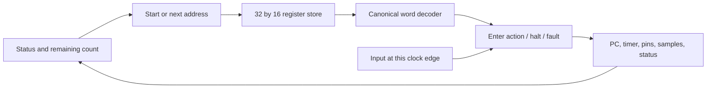

# Execution core: Lean circuit through generated RTL

Implementation record: **2026-09-13**, Apple Silicon macOS. The structural implementation and proofs were committed as `828d68a`; the reproducible RTL checks and synthesis were committed as `2b2dffc`. This completes milestone 3 of the [processor plan](processor-verification.md). The [hardware baseline](hardware-baseline.md) owns the instruction and interface contract.

The same circuit runs UART, SPI, and mixed timed-action programs by replacing its instruction contents. It contains a 32×16 register bank, a combinational read path and decoder, PC/status/timer registers, three output registers, eight capture registers, and program-valid/idle registers. All behavior is built from the width-indexed circuit primitives interpreted by Lean and traversed by the emitter.

## Why these blocks belong together

The instruction store supplies the next word; the decoder classifies it and exposes fields; the scheduler decides when that word takes effect. The timer's expiration is the instruction-entry edge. On that edge, the scheduler installs the new pin levels, duration, status, PC, and optional captured input simultaneously. Fetch and decode must fit within the physical clock period for this implementation. The cycle proof does not establish that period.



There is one shared entry function for start and action boundaries. Accepted start reads address zero and clears old samples before any requested entry capture. At expiration, the read address is PC + 1; PC 31 is guarded and faults without wrapping. A positive timer count decrements while pins and samples hold.

Two duration-one actions followed by halt provide the smallest complete experiment:

| Edge after accepted start | State and effects |
| --- | --- |
| 0 | Enter action 0; output its levels; capture its input if requested; remaining = 0 |
| 1 | Enter action 1; update levels and capture the input observed on edge 1; remaining = 0 |
| 2 | Enter halt; completed, idle levels, retained samples |

No extra fetch or decode cycle appears between actions. An asserted start or commit while active is ignored even on the edge entering halt. A held request may be accepted on the following stopped edge.

## Implemented loading and initialization boundary

The **internal** interface accepts a complete 32-word image and three idle bits on a stopped commit edge. These are wide synchronous core signals, not a package pinout or serialized uploader. Commit replaces every word atomically, clears execution/results, and establishes program validity. Commit wins over start while stopped; reset wins over both; cold initialization wins over all requests.

Cold initialization clears validity, idle profile, PC, status, timer, outputs, and samples while leaving instruction words untouched. A start before a committed image is ignored. Execution reset retains the image, idle profile, and validity. Observations are specified after initialization; the RTL test begins with unknown registers and establishes known execution state using this clocked request.

A physical loader still needs a transport, staging storage, incomplete-upload behavior, and pin/clock-domain contracts. Adding a synchronous RAM would likewise require a new read-latency argument. Neither can silently add cycles to the established execution contract.

## Proof coverage

| Source | Checked claim |
| --- | --- |
| `Hardware/Circuit.lean` | Fixed-width expression semantics and substitution; each register sees the same pre-edge snapshot |
| `Hardware/Decode.lean` | Structural outputs match field extraction; field interpretation equals the canonical decoder for every 16-bit word |
| `Hardware/Store.lean` | The finite mux read selects the addressed word for every five-bit address and memory valuation |
| `Hardware/CoreState.lean` | Concrete register representation and its projection back to engine state |
| `Hardware/Core.lean`, `CoreProofs.lean` | Actual next-register expressions equal the executable scheduler equations, including all word and capture registers |
| `Hardware/Refinement.lean` | Exact raw-engine clock-step and arbitrary-length run correspondence, plus initialization, stopped commit, invalid start, and busy-commit behavior |
| `Hardware/Protocols.lean` | Start and run of encoded programs reproduce engine execution; composition recovers UART/SPI waveforms and the SPI received byte |

The relation is a canonical embedding: after commit, concrete state equals `Core.embed program engineState`. Inactive PC/timer bits are zero. `tick_refines` includes arbitrary reset/start/sample values for an execution edge; `run_refines` extends uninterrupted execution to any number of cycles and any input history. `busy_ignores_commit` handles active requests with arbitrary replacement images. `commit_stopped` establishes the relation for a new raw program, including malformed words. Malformed entry faults with idle outputs and no new capture; it is distinct from legal-program compiler correctness.

Sixteen selected theorem dependency checks accept only `propext`, `Classical.choice`, and `Quot.sound`. There are no admitted goals, native-checker assumptions, or project-defined axioms in those dependencies. These are digital circuit-model proofs, not a proof about emitted text or analog pins.

## Executable and RTL evidence

The Lean compiler exports the actual UART and SPI instruction images. `scripts/core-vectors.py` then interprets raw words with an independently written **absolute deadline**, rather than reproducing the decrement circuit. It separately checks protocol pin formulas and SPI receive edges without using compiler action arrays as the waveform oracle. Both Lean circuit execution and the generated RTL consume the resulting input/expectation vectors.

- All **65,536** decoder words checked in structural Lean execution and standalone RTL; **18,433** are accepted.
- **71,703** complete-core edges match the oracle and produce byte-identical Lean/RTL observation traces.
- **1,032** protocol transfers: every byte at durations 1 and 4, plus bytes `00`, `53`, `a6`, `ff` at duration 256, for both UART and SPI. The formal theorems cover the full parameter ranges.
- One unchanged RTL module runs successive UART/SPI/UART programs. Each commit and subsequent edge checks all 32 stored words, idle profile, execution state, and receive data.
- Mixed 1/4/256/1 actions; capture at start and boundaries; overwritten slots; halt at zero/31; exhaustion; malformed halt, disabled-capture slot, and high-opcode words; randomized memory images reaching every address.
- Reset at all 69 observed phases of a four-cycle SPI transfer, followed by restart, cold initialization, and rejection of invalid starts. Busy commit/start are also exercised through completion edges.

The original UART (768 transfers), SPI (1,792 transfers), shared-engine (2,560 transfers plus boundaries/reloads), and countdown (38,026 edges and three rejected faulty fixtures) suites also passed after integration.

The tests deliberately mutate generated RTL to delay capture by one edge, skip an instruction address, and allow wrapping at slot 31. Each fixture must compile successfully and then fail its designated behavioral assertion. A parse failure cannot count as detection.

## Translation and synthesis boundary

Yosys generic synthesis and `check -assert` passed with **1,907 cells**, including **543 flip-flop bits**: 512 instruction bits, three idle bits, one validity bit, two status bits, five PC bits, nine timer bits, three output bits, and eight capture bits. The other 1,364 cells implement generic logic/multiplexers. Instruction storage is the dominant register cost; staged physical loading would add storage beyond this baseline.

The emitter maps slices to `comb.extract`, equality to `comb.icmp`, muxes to `comb.mux`, and register updates to `seq.compreg`. Common expression text is shared during emission. The generic module adapter enumerates typed ports and registers; the core logic comes from `Core.circuit`.

The first generated core used packed-array indexing that this Icarus build could not elaborate. The final pipeline sets `disallowPackedArrays`/`disallowLocalVariables` and runs `--hw-legalize-modules` before export, following [CIRCT's lowering guidance](https://circt.llvm.org/docs/VerilogGeneration/). The fixed source is the emitter/pipeline; generated RTL is not manually repaired.

Simulation validates the emitted decoder/core on the recorded inputs. No Lean-to-MLIR preservation theorem, formal RTL equivalence, or RTL-to-gate equivalence has been established. Generic synthesis supplies an implementation cost baseline, not technology-mapped area, tile fit, routed timing, or a supported clock frequency. The testbench's clock period is stimulus timing only. Synchronization, metastability, electrical compliance, and physical package loading remain outside this result.

## Reproduce

With the pinned Lean toolchain and existing local hardware tools:

```sh
python3 scripts/check-core.py
```

Install the tools first with `python3 scripts/install-hardware-tools.py` on supported Apple Silicon hosts. The core runner builds the library, audits proofs, emits circuits/images, generates independent vectors, checks Lean and RTL, rejects faulty fixtures, and runs generic synthesis with `check -assert`. See [development setup](development.md) for tool versions and restricted-session invocation.

`build/core/report.json` records source/artifact SHA-256 values, tool versions, coverage, mutation outcomes, and generic cell counts. It is removed before each run and written only after all checks pass. Intermediate logs, MLIR, RTL, traces, images, and netlists remain under ignored `build/core/`. The prior timer receipt remains a separate experiment under `build/hardware/`.

Recorded artifact SHA-256 values for this checked core:

| Artifact | SHA-256 |
| --- | --- |
| `core.mlir` | `ee06419d0782e3a92f9de9cc248d12d3560da205122a8478ff9da1a793902058` |
| `core.sv` | `320abc9d093c0df3db23d99b6da1eb24c95a80e9d2aefd412391dbc32ac22290` |
| `lean.csv` | `8c465a8d8c381cae408e5bf80be864de5a93da8283893e1190b8472c286a5ec7` |
| `netlist.json` | `323300cf3a2dcc6515f67c7802cb662ae73dc67d09c13959ca7e531120170aa4` |

The next bounded hardware work is translation/equivalence evidence and a concrete staging/commit interface. Protocol extensions such as reactive waits, output-enable/line release, reusable payloads, and I²C require their own instruction-contract changes and renewed proofs.
