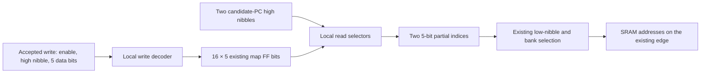

# Costing an index-map slice

The approved slice study is complete. A bit plane is an exact data ownership
boundary, but its current mapped implementation imports many shared control
nets. The follow-up [local-decoding tile experiment](map-tile-study.md) is now
complete: its compact interface survives mapping, but shared-signal distribution
remains the next cost discriminator. These studies establish no routed improvement.

The [selected receipt](../../physical/experiments/map-slice-results.json) records
the original September 21, 2026 slice checks below. The
[tile plan](../../physical/experiments/map-tile-plan.json) specifies the next
experiment. [Research status](../research/status.md) owns the work allocation;
the [architecture study](chip-architecture-study.md) retains the complete-chip
comparison and the earlier rejected address-window projection.

## What is bound to the circuit

`SramAssembly.indexLocation` extracts bank and word coordinates from the actual
typed register constructor. The existing emitter adds those coordinates to
its state manifest. Names may change without changing the slice definition.
No datapath, register, observation or execution edge is added.

`chip_map_slice.py` starts at those mapped flip-flops and traces the actual
combinational graph. It checks that each stored bit's update depends on no other
stored map bit and that each SRAM index-address bit reaches exactly its
corresponding plane across both banks. Other state, package inputs and SRAM Q
remain separate roots; dependence is conservative through every cell input.

Data-bearing gates follow the map bits they consume. A gate whose map data spans
several slices remains shared. Logic with no stored-map dependency joins a slice
only when all its consumers already belong there. Required support left outside
the slices is counted once in a shared group. State and remaining chip logic
are also fully accounted for. This avoids charging the same decoder to every
slice or silently giving a slice free control logic.

Areas use the retained Liberty attributes in the saved mapping. Their sum
reproduces the earlier complete standard-cell area, **292,580.0514 µm²**.
The independent Verilog read-back reproduces state membership, boundary signal
signatures, cell counts, area and net budgets. These are artifact-consistency
checks, not a new technology-mapping proof.

## The complete bit plane

Bit zero of every index word gives 512 flip-flops: 256 words in each of two
atomic banks. Both read paths and the upload updates belong to this study.

| Selected plane, actual mapped graph | Cost |
| --- | ---: |
| Stored bits / flip-flops | 512 |
| Private combinational cells | 1,986 |
| FF plus private-cell area | 48,576.5532 µm² |
| Incoming nets | 1,073 |
| Outgoing nets | 2, one index bit per SRAM replica |
| Internal nets | 2,496 |

Of its incoming nets, 520 feed update logic, 220 feed the first read path, 330
feed the second, and three feed both readers. These are actual mapped signals,
not independent bits of information. Of the 1,073 nets, 744 directly serve all
five planes, and 1,062 serve at least two. This is substantial distributed
control even though the data outputs are only two bits wide.

The five planes together own all 2,560 map FFs and 9,155 combinational cells,
occupying 244,924.9110 µm². Another 2,046 shared support cells occupy
17,196.7698 µm². The remaining chip accounts for 335 FFs and 1,392 combinational
cells, or 30,458.3706 µm². These disjoint areas sum to the complete standard-cell
cost. A plane's individual read/update cones overlap; their sizes are not
additional area to add to this census.

## Match grouping to the actual read tree

`Execution.readTree` branches on address bit zero at the outermost mux. Thus
bit zero is selected **last along the combinational path from storage**;
high address bits are selected nearer the stored words. A bottom 16-word subtree
has a fixed low nibble and varying high nibble:

```text
fixed low nibble = 0:  0, 16, 32, …, 240
fixed low nibble = 1:  1, 17, 33, …, 241
...
fixed low nibble = 15: 15, 31, 47, …, 255
```

We compared one consecutive 16-word grouping with the corresponding
read-tree grouping. Both own **80 bits in one bank**, and both use the existing
mapped graph; no circuitry was regrouped or remapped.

| First tile in bank zero | Consecutive words 0–15 | Equal low nibble, words 0,16,…,240 |
| --- | ---: | ---: |
| FF bits | 80 | 80 |
| Private combinational cells | 151 | 294 |
| FF plus private-cell area, µm² | 5,508.5184 | 7,662.0978 |
| Incoming nets | 61 | 280 |
| Outgoing nets | 90 | 13 |
| Owned cells in first read cone | 10 | 76 |
| Owned cells in second read cone | 0 | 76 |

The consecutive tile appears smaller because much of its read computation
remains outside. Seventy of its outgoing nets serve both read paths. The
read-tree tile keeps more computation local and exports six nets toward the
first reader and seven toward the second. It still imports 87 read-zero,
85 read-one and 108 update nets. Its mapped boundary is therefore much wider
than a compact RAM-like interface would suggest.

Across all 32 tiles, consecutive grouping gives 4,099 distinct nets crossing
slice boundaries; read-tree grouping gives 1,615. The five much larger bit
planes give 1,265. A shared net is counted once in these totals, even if it
reaches many slices; summed per-slice incoming counts are different quantities.
The tile results **do not establish superiority over bit planes**. They identify
an appropriately shaped small block for testing local decoding. No wire lengths,
placement legality, timing or physical capacity were measured here.

## The next concrete implementation experiment

Specify one tile with 16 five-bit entries, two combinational read addresses
and one clocked update. Its fixed bank and low nibble determine which existing
registers it owns. The proposed functional interface is:

| Port | Bits | Meaning |
| --- | ---: | --- |
| `read_hi0`, `read_hi1` | 4 each | High nibbles of the existing two candidate PCs |
| `write_hi` | 4 | High nibble of the accepted index address (`cursor - 64`) |
| `write_data` | 5 | Existing index payload |
| `write_enable` | 1 | Accepted index push to the inactive bank and this low nibble |
| `index0`, `index1` | 5 each, output | Both partial lookup results before the SRAM edge |

That is **18 functional input bits and 10 output bits**, plus the existing
clock. This is a proposed module contract, not a measured reduction of the
current mapped boundary. Local decoding may duplicate logic currently shared
across tiles, so its area, depth and fanout must be measured.



The bank/low-nibble write predicate stays tied to existing loader admission and
atomic ownership. `Loader.Store.next` updates only on a matching write and
otherwise holds state; reset disables writes through the existing loader gate.
The tile needs no new clear operation, pipeline register or SRAM macro.

The next increment should define that tile from the existing `readTree` and
store-update expressions, prove its two reads and every stored next value match
the current projection, then map one instance with the boundary preserved.
Check that the intended ports survive mapping and account for duplicated
decoding and the remaining map glue. Immediate start, consecutive branches,
reset retention and abort/replacement keep their existing edge contracts.
A changed chip emission needs a new independent RTL/mapped comparison. Only a
useful complete-chip mapping result should advance to placement/global routing.

This follows the typed-interface approach already adopted from Hardcaml: a
boundary describes the actual state, computations and wires. Lean supplies the
behavioral obligations; mapping determines whether the chosen allocation has
the expected cost. The current work creates no second machine semantics or
generic placement framework.

## Reproduction and limits

```sh
python3 -B scripts/report-chip-architecture.py --tag NAME
python3 -B -m unittest discover -s test -p test_chip_architecture.py -v
```

Use a fresh tag. `hybrid-map-slices.json` contains all three partitions, selected
state/cells, actual input/output boundary signatures, role counts and shared
support. The direct chip is retained as the unchanged comparison and has no
index-map slice. All four MLIR and RTL artifacts must still match `corridor-02`.

`build/validation/map-slice-check-01/report.json` passes the library/emitter build,
standard-axiom audit, `Interfaces`, emissions/exports and both mapped read-backs.
The audit covers 14,484 declarations and 7,393 theorems. All 30 focused Python
tests pass, including coordinate errors, cross-bit dependencies, external
control consumers, strided read subtrees and renamed/re-numbered artifacts.
The gate takes **17.166 s**, including 2.339 s for graph analysis/read-back.
There is no new synthesis, RTL simulation, OpenDB export, placement or routing.
Earlier receipts, the rejected window projection and pending licensing remain
unchanged. The proposed tile is specified, not implemented or physically qualified.
