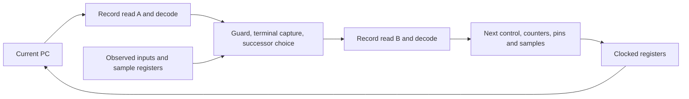

# Integrated reactive execution core

The E64 frontend now connects to a structural reactive scheduler in Lean. Both
the direct and indexed versions implement the same 256-address, 16-sample
engine, with drive enables, waits, guarded actions, qualification, terminal
capture, and conditional successors. This extends the earlier 32×16 UART/SPI
hardware baseline; its internal atomic commit interface remains a separate
experiment.

## The clock-edge contract

The current address reads one record. Its decoded finish and terminal capture
select the successor address, which reads the second record. On the terminal
edge, the core installs the successor's pin commands and counters immediately.
There is no extra fetch or dispatch cycle.



A branch sees the newly captured terminal bit. Successor entry capture happens
after that choice and may overwrite the same sample slot. Guard failure prevents
terminal capture. A ready input wins over timeout on the final wait edge.
Qualification retries restart the consecutive-ready countdown; ready progress
restores the wait budget. Sequential execution past the program's last address
faults, including address 255, without wrapping. Reset wins over start; start is
ignored while busy.

The two reads are combinational. Replacing either with synchronous memory needs
a revised schedule or a proved prefetch design; it cannot silently add a cycle.

## Proof coverage

All **69 public reactive hardware theorems** pass the dependency audit, allowing
only Lean's standard axioms or none: the 55 of the integrated core, plus the 14 of
the later fetch, fetch-choice and interface modules, which the audit list had
omitted until 2026-09-17. The chain is:

1. Structural decoder, capture, comparator, and scheduler expressions equal
   explicit register-update equations.
2. The scheduler clock edge equals the typed engine's `step`, including reset
   and start, for every typed program, model state, and two-bit input.
3. Direct or certified indexed memory supplies both required encoded records.
   The structural bindings preserve their meaning.
4. `Core.machine_next` and `Core.machine_run` establish equality of the complete
   register bank with the embedded engine state plus unchanged memory and
   metadata, for arbitrary admissible execution histories.

An admissible history contains no accepted program writes: writes may be absent,
or attempted while busy, resetting, or starting, when hardware blocks them.
The initial memory must represent the chosen program; indexed storage also
requires the certificate that all 256 expanded lookups match. These are explicit
premises, not assumed power-up contents. The universal theorem applies to every
supported typed program, including the wider I²C-read program. Existing compiler
proofs describe its protocol behavior; the new core theorem supplies the hardware
implementation of that same engine semantics.

This batch does **not** prove that arbitrary raw setup writes are an atomic
abstract load, or that an arbitrary malformed image implements a typed program.
The decoder and entry logic reject invalid records, and executable tests cover
malformed starts. Lean proofs stop at the circuit semantics: the text adapter,
CIRCT lowering, RTL simulator, and synthesis tools are separately tested tools.

## Raw setup interface

The generated modules have synchronous `reset`, `start`, two observed input bits,
and a raw setup port: `write`, two-bit `bank`, eight-bit `address`, and 64-bit
`data`. Writes are accepted only when idle with neither reset nor start asserted.

| Bank | Direct core | Indexed core |
|---|---|---|
| 0 | Write a 64-bit record at address 0–255 | Write dictionary entry 0–63; higher addresses ignored |
| 1 | Ignored | Write six low data bits to the address map at 0–255 |
| 2, address 0 | Idle levels in data bits 0–2 and enables in 3–5 | Same |
| 2, address 1 | Last address in data bits 0–7 | Same |
| Other metadata addresses or bank 3 | Ignored | Ignored |

Reset clears execution and samples but preserves stored records and metadata.
The testbench first establishes reset control, writes every storage location and
both metadata words, then resets again before starting. It does not initialize
RTL registers by simulator backdoor. Output checking begins after setup makes
pins and metadata known.

This interface is **non-atomic**. A host can start a partially replaced program;
there is no staging bank, validation/commit protocol, or physical transport yet.
The later [atomic-loader reference](atomic-loader.md) implements staging, validation, and commit for the indexed core; these two raw-interface modules remain the comparison baselines. Physical transport and pin mapping remain open.

## Executable evidence

One instance of each generated module loads UART, SPI, I²C write, and I²C read
without regeneration. An independent Python E64 interpreter produces full
post-edge states. Lean evaluates the structural scheduler and store reads at
the named component boundaries; the generated RTL independently checks the same
expected states, plus busy and current-address outputs.

- Direct: **27,753 edges**, **27,493 checked RTL states**.
- Indexed: **31,785 edges**, **31,461 checked RTL states**. Extra edges write the
  larger number of addressable setup registers in this layout.
- Each core executes one UART frame, one full-duplex SPI byte, one stretched
  I²C write, and **23 I²C reads**: eight returned bytes under quiet and stretched
  clocks, plus all seven non-all-ACK combinations.
- The I²C target reacts to wire edges and byte counts, independently of PCs.
  Its monitor checks outgoing bytes, received bits and ACK status, open-drain
  release, repeated START, final NACK, STOP, pulse counts, and minimum four-cycle
  high/low intervals. Quiet/stretched successful reads take **502/557 cycles**.
- Directed cases cover terminal forwarding followed by same-slot overwrite,
  failed guards, zero/one/255 wait counts, qualification retry and timeout,
  reset/start/write collisions, unsigned target bounds around 127/128 and 255,
  sequential no-wrap, and 16 malformed starting records.
- Six RTL mutations swap observed inputs, suppress start, or corrupt setup
  addressing, in each layout. Every variant must fail the state oracle.

These are bounded executable checks. Arbitrary-history claims come from the
Lean correspondence proof, not from the number of tested transactions.

## Hardware cost and reproduction

The cores retain all writable storage, plus 49 execution register bits and 14
metadata bits. Both use the same unconstrained generic Yosys synthesis flow.
Final measurements are recorded in `build/reactive-core/report.json`.

| Integrated circuit | Register bits | Combinational cells | Total generic cells | Longest combinational path, cells |
|---|---:|---:|---:|---:|
| Direct 256×64 | 16,447 | 70,258 | 86,705 | 68 |
| Indexed 64×64 + 256×6 | 5,695 | 24,037 | 29,732 | 86 |

Indexed storage reduces total generic cells by **65.7%**, with a longer dependent
lookup path and a maximum of 64 distinct records. Compared with the standalone
frontend's 26/34-stage paths, the complete 68/86-stage paths show why scheduler
integration was necessary before making timing judgments. Retain indexed as the
storage candidate and direct as the comparison baseline; a technology-constrained
flow must decide whether either meets a chosen clock.

This comparison includes both dependent reads, decoders, scheduler, captures,
pin control, raw writes, and metadata. It excludes an atomic loader, external
transport, input synchronizers, pads, and technology-specific implementation.
Generic cell counts and topological depth are not ASIC area or clock frequency.

```sh
python3 scripts/check-reactive-core.py
```

Use the pinned Lean and hardware tools from [development setup](development.md).
No binary fixture prerequisite or new tool is needed. The runner builds Lean,
audits all public hardware theorems, emits both cores and compiler images,
generates independent vectors, checks RTL and Lean components, rejects mutations,
and synthesizes both alternatives. Its success receipt includes source/artifact
hashes and tool versions and is written only after all gates pass. Generated
MLIR, RTL, vectors, netlists, and logs remain under ignored `build/reactive-core/`.

The original core regression also passes all 71,703 edges and retains its 1,907-cell
result. The E64 frontend regression retains all 100,546 decoder vectors, both
5,633-pair store checks, five mutation rejections, and each 4,468-transaction
packed read matrix. These checks cover the shared circuit/emitter primitive change.

The emitter writes the proved component bindings as named wires to avoid
repeated expansion of the same read trees. The scheduler and memory gate
expressions still come from their Lean circuit descriptions; this adapter is
part of the unproved translation boundary.

The subsequent [atomic-loader milestone](atomic-loader.md) implements and proves
staged upload, validation, commit, and old-program preservation for the indexed
candidate. [Early CMOS5L mapping](technology-mapping.md) now measures this raw
indexed baseline alongside that loader: the double-bank register design exceeds
the nominal area allocation before physical overhead. Next resolve storage cost
while preserving execution timing and the loading contract. Translation
equivalence, external transport, and routed timing remain separate milestones.
