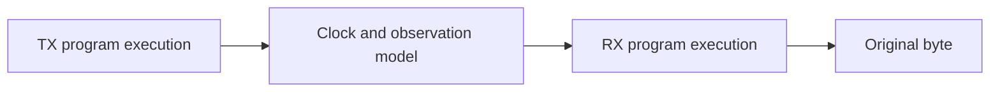

# UART link timing and roundtrip

Implemented 2026-09-15. A transmitted 8N1 byte now has a Lean proof through
independent clocks, a bounded digital observation delay, start detection, and
reception. The result also composes through the existing TX and RX compilers.

The [one-byte receiver](protocols/uart-receive.md) previously required the client to supply
correct start and data/stop samples. This milestone derives those samples from
the actual transmitter waveform and numerical timing conditions. It establishes
one-frame communication under a stated environment contract.



## Digital clock and observation contract

All times use one arbitrary integer quantum. A finer quantum can represent
fractional clock relationships; no nanosecond value or operating frequency is
assigned. Each clock has a positive, constant tick length. TX begins its start
bit at `txStart`; RX edge `n` occurs at `rxPhase + n × rxTick`.

An RX observation of age `age(n)` reads the transmitter at that much earlier
global time. Before the delayed start becomes visible, the wire is idle high.
The age can change independently at every observation within inclusive bounds
`Dmin ≤ age(n) ≤ Dmax`. This includes fixed delay and bounded digital variation.
TX transitions belong to the new symbol: symbol intervals include their start
and exclude their end.

The receiver is armed at cycle zero, observes idle high on edge one, and then
searches for low. Reset, program replacement, and new TX requests during this
one-frame run are outside the link theorem; their separate endpoint contracts
remain in the TX/RX models.

## Sufficient timing bounds

| Symbol | Definition in global time quanta |
| --- | --- |
| `P` | TX cycles per bit × TX tick length |
| `Q` | RX cycles per bit × RX tick length |
| `R` | RX tick length |
| `C` | floor(RX cycles per bit / 2) × RX tick length |
| `S` | Observation-age spread, `Dmax − Dmin` |

`UART.Link.Safe` requires:

```text
rxPhase + R < txStart + Dmin
S ≤ C
C + S + R ≤ P
9 × P + S ≤ C + 9 × Q
C + 9 × Q + S + R ≤ 10 × P
```

The first condition gives the receiver time to observe idle high. The next two
keep start confirmation inside the transmitted start bit. The last two keep
the stop sample inside stop. The nominal clock offset changes linearly across
the ten symbols. Reserving `S` for changing observation age lets those endpoint
bounds imply the eight intervening data windows.
The extra `R` covers uncertainty about which RX edge first sees the start.

Let `firstEdge(delay)` be the first RX edge at or after `txStart + delay`.
The proof finds the actual first low edge `d` in
`firstEdge(Dmin) ≤ d ≤ firstEdge(Dmax)`, with `d ≥ 2`. It derives every designated
sample from the TX waveform and proves reception of the original byte at:

```text
d + floor(RX cycles per bit / 2) + 9 × RX cycles per bit
```

With fixed delay the detection interval collapses to one edge. For equal unit
clocks, zero delay/phase, and a start at RX cycle two or later, the ideal theorem
holds for every byte and every shared bit period from **8 through 256**. The
general theorem also permits differing cycles-per-bit settings: TX supports
1–256 and RX supports 8–6656, provided their global periods satisfy `Safe`.

These are sufficient, byte-independent bounds. They are not claimed to be
optimal: a known phase can work outside the reserved uncertainty margin. A
universal percentage tolerance would discard the dependence on sampling rate,
phase, and observation-age spread.

### Example with unequal clocks

This configuration uses 16 cycles per bit at both endpoints, with TX ticks of
97 quanta and RX ticks of 100. Observation age may vary from 20 to 60 quanta:

```lean
import Pinwheel

def linkTiming : Pinwheel.UART.Link.Timing :=
  { tx := ⟨15⟩
    rx := ⟨16, by decide, by decide, 0⟩
    txTick := 97
    txTickPositive := by decide
    rxTick := 100
    rxTickPositive := by decide
    txStart := 370 }

def linkLatency : Pinwheel.UART.Link.Latency := ⟨20, 60, by decide⟩

example : Pinwheel.UART.Link.Safe linkTiming linkLatency := by decide
```

Here `P = 1552`, `Q = 1600`, `C = 800`, and `S = 40`. Start is detected at RX
edge 4 or 5, and the byte is available at edge 156 or 157. The compiled theorem
accepts any age history within those bounds and either selected RX input.

## Repository integration and proof owners

| Owner | Responsibility |
| --- | --- |
| [Link.lean](../Pinwheel/UART/Link.lean) | Clock/age definitions, executable observation, decidable sufficient bounds, ideal configuration |
| [LinkTiming.lean](../Pinwheel/UART/LinkTiming.lean) | Detection-edge bounds and all ten numerical observation windows |
| [LinkProofs.lean](../Pinwheel/UART/LinkProofs.lean) | First-low detection, waveform-to-sample proof, byte recovery, fixed-delay and ideal corollaries |
| [Compile/UARTLink.lean](../Pinwheel/Compile/UARTLink.lean) | Actual compiled TX pin, selected RX input, and compiler composition |
| [test/UARTLink.lean](../test/UARTLink.lean) | Executable communication, timing boundaries, and counterexamples |

The public model theorem is `UART.Link.transmitter_correct`. The compiler theorem
is `Compile.UARTLink.receive_correct`; `receive_fixed` and `ideal_receive` expose
the exact completion edge in their special cases. The client supplies timing and
age bounds, without supplying `Rx.SamplesFrame` or an assumed received byte.

Compiler composition relates two independent modeled instances: the existing
TX `Engine.Program` and RX `Reactive.Program 255 15`. TX's unrelated input and
the spare RX input may vary arbitrarily. Existing RX lowering and storage proofs
remain owned by [the receive implementation](protocols/uart-receive.md#repository-integration).
This theorem does not schedule both programs on one core.

The clock relation lives beside UART, where its concrete start/data/stop
obligations are known. It does not change the common engine's edge semantics or
the [timed-component interfaces](engine/timed-components.md).

## Validation and receipts

The accepted comparison started from `c133af9` plus the locally validated UART RX
addition, identified by the earlier `uart-rx-01` receipts. Its missing boundary
was the connection between the TX waveform and the receiver's input assumptions.
The pre-run brief selected local Lean proofs, compiler composition, numerical
checks, and a fresh `uart-link-01` foundation run. The preceding foundation run
took about 12 minutes; no new resource cap or external execution was specified.
Success requires complete proofs, the axiom audit, and passing executable suites.

```sh
lake build
lake env lean -DwarningAsError=true --run test/UARTLink.lean
python3 scripts/check-foundation.py --tag <fresh-tag>
```

The link suite advances the TX model and compiled program once per TX clock,
retains their actual pin trace, and feeds it through the observation model to
the RX model and compiled program. A separate global-time waveform calculation
checks the wire. Each RX edge checks compiler state equality, released outputs,
and, for safe cases, the byte result and completion edge.

- **3,072 ideal frames:** every byte, both inputs, periods 8, 9, 16, 127, 255, 256.
- **800 varied frames:** unequal clocks and bit-count settings, RX phases, fixed
  endpoint delays, alternating extreme delays, and deterministic varying delays;
  includes TX period 1, RX period 6656, and equality at sufficient-bound endpoints.
- **5,614,752 RX edges** across those positive frame cases.
- **2,160 timing combinations:** 1,136 satisfy `Safe` and pass every candidate
  detection-edge/symbol window at both age extremes; 1,024 are excluded.
- Four counterexamples cover excessive drift in both directions, missing idle
  arming, and an age history outside its contract. One successful excluded case
  demonstrates that `Safe` is sufficient rather than necessary. Explicit adjacent
  edge checks cover the half-open transition convention.

The **`uart-link-01` foundation gate passed** on Lean 4.33.1:

| Check | Result |
| --- | --- |
| Library modules reachable from the default import | 112 / 112 |
| Whole-library axiom audit | 9,434 declarations, 4,949 theorems; standard axioms only |
| Injected custom axiom | Rejected for the expected reason |
| Executable suites | 22 passed, plus the independent binary and UART RX/E64 oracles |
| Wall time | 757.769 seconds |

Audit counts include generated declarations and theorems. Receipt:
`build/validation/uart-link-01/report.json`, SHA-256
`349f049c242dcfa3bee4bf00c858b6cabdcde2a2759f11d69e1cf3748771f138`.
The runner checked that every recorded source hash stayed unchanged throughout
validation. Focused results: `build/uart-link/report.json`, SHA-256
`565a92bfc49bfb5d65c31942b1f3b2922480bd63484cb047ff3cfe196245bcb6`.

The source runners reproduce these checks with fresh tags; ignored artifacts
are not a durable backup. Earlier RX hardware receipts describe their own source
snapshot. This milestone adds Lean/model evidence and performs no CAD run.

## Remaining boundary and subsequent Lean work

The age history is a digital sampler assumption. The proof does not establish
that a synchronizer or physical pin meets any particular age bound, resolve
metastability, or qualify a clock/baud rate. Those need a concrete sampler and
separate implementation/electrical evidence.

The [continuous receive milestone](protocols/uart-stream.md) adds successive ideal frames,
delivery ownership, automatic rearm, reset, and overrun semantics. It also records
a case where the one-frame `Safe` bounds hold but rearm misses the next start.
The subsequent [continuous clock contract](protocols/uart-stream-clocks.md) supplies the
additional rearm condition and proves finite-stream reception with unequal
clocks and varying bounded observation age through the compiled RX supervisor.
Simultaneous TX/RX still needs a resource design.
