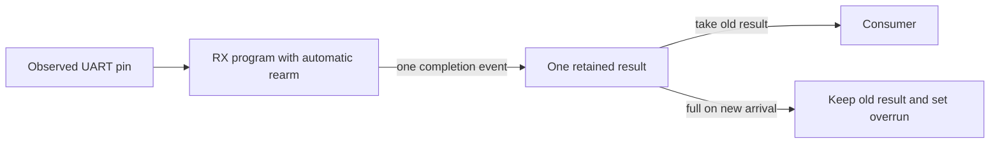

# Continuous UART receive

Implemented and validated 2026-09-15. The Lean receiver
rearms automatically, retains one unread result, and reports overrun when a late
consumer leaves that slot full. Finite ideal back-to-back frames have an exact
completion-event proof, composed with the existing compiled RX program.



## Edge and ownership contract

`Rx.Stream.Input` carries the observed `line`, consumer `take`, `clearOverrun`,
and `reset`. Receiver state and buffer state have separate owners. A pending
`Rx.Outcome` is either a good byte or a framing error with the captured byte;
the consumer must inspect its tag. Reception proceeds regardless of consumption.

On an ordinary edge, consume the value present **before** the edge, then process
the receiver's **new** completion. The result after that edge becomes the next
pending value. The table also applies when an outcome contains a framing error.

| Old pending | `take` | New arrival | Delivered | New pending | Overrun event |
| --- | --- | --- | --- | --- | --- |
| Empty | Either | `B` | None | `B` | No |
| `A` | False | None | None | `A` | No |
| `A` | True | None | `A` | Empty | No |
| `A` | True | `B` | `A` | `B` | No |
| `A` | False | `B` | None | `A` | Drop `B` |

There is no empty-slot bypass. Overrun is sticky until clear or reset. Clear
happens before a new drop, so a simultaneous clear and drop leaves overrun set.
Reset has priority over consumption and reception: it aborts the active frame,
flushes any old pending result, and clears overrun. A reset on the completion
edge produces no arrival. The next non-reset edge arms the receiver; it then
needs an idle-high observation before detecting another start.

`Receipt` records accepted, delivered, dropped, and flushed occurrences for proof
and observation. The lists in `Buffer.run` and `Stream.commands` are logical
histories, not additional buffer capacity or a promised hardware event log.
The retained overrun flag alone does not count lost results.

For example, at eight cycles per bit with the first start on edge 3, two
back-to-back frames complete on edges 79 and 159. If the consumer waits until
159, that edge can deliver the first result and retain the second. With no take
on 159, the second result is dropped and the first remains pending.

## What Lean proves

| Claim | Owner / theorem |
| --- | --- |
| Every arrival is accepted or dropped on its edge | [RxBufferProofs.lean](../Pinwheel/UART/RxBufferProofs.lean), `step_partition` |
| Accepted occurrences retire in order or remain pending | `Buffer.run_order`; retirement preserves the chronological order of deliveries and reset flushes |
| Initial pending + arrivals = deliveries + drops + flushes + final pending, counting occurrences | `Buffer.run_accounting`, for arbitrary command histories |
| With no drops or flushes, arrivals are delivered in order or remain pending | `Buffer.run_lossless`; a drained slot gives exact delivery equality |
| Consumer controls and buffer fullness cannot change reception timing | [RxStreamProofs.lean](../Pinwheel/UART/RxStreamProofs.lean), `receiver_independent` |
| A completed result is not repeated on the next edge | `no_repeated_arrival`; reset and ordinary rearm are covered |
| Stream buffer state equals execution of its logical command history | `buffer_trace` |
| Valid successive frame segments have exactly the specified result pulses | [RxFrames.lean](../Pinwheel/UART/RxFrames.lean), `series_correct` |
| Ideal back-to-back wire discharges the frame-segment premises | [RxWire.lean](../Pinwheel/UART/RxWire.lean), `ideal_matches` and `ideal_series` |
| Existing compiled RX and supervisor preserve state and every receipt | [Compile/UARTRxStream.lean](../Pinwheel/Compile/UARTRxStream.lean), `step_simulation`, `run_simulation`, `ideal_series` |

The count and ordering statements concern occurrences, including repeated equal
bytes. They distinguish intentional loss from a late consumer and explicit reset
flushes. They do not claim every transmitted byte is delivered under arbitrary
consumer behavior.

### Wire timing and automatic rearm

For bit period `B` and `H = floor(B/2)`, a start detected on edge `d` completes
on `d + H + 9B`. The existing endpoint spends the following edge rearming; that
edge's pin value is not observed by start detection. A later edge must observe
idle high before the next low start.

The ideal theorem assumes an initially armed receiver, start on edge 2 or later,
no reset, equal unit clocks with no observation delay, and any finite byte list.
It covers **every shared period 8–256**, both RX inputs, arbitrary consumer/clear
histories, and arbitrary initial buffer contents. It proves the exact pulse
stream through the final rearm edge. Each successive start lies
`B − H − 1 ≥ 2` edges after the previous rearm edge, enough to observe high.

`wireBody` concatenates the existing one-byte `UART.expected` waveform. This is
a source specification for adjacent wire frames. Scheduling repeated launches
of the current one-byte TX machine is a separate obligation. The executable
tests concatenate cached actual reference/compiled TX traces and compare them
with an independent bit-index wire oracle.

`Stream.link_frame` derives a single segment from the earlier [clock and bounded
observation-age contract](uart-link.md), using a one-frame source history.
`Matches` requires a fresh arming interval for each subsequent segment. The
general sequence theorem supports independently justified segments; extending
the numerical link proof to a continuous wire requires showing that each local
source agrees with that wire over the relevant prefix. The subsequent
[unequal-clock milestone](uart-stream-clocks.md) supplies this agreement,
suffix composition, and sufficient rearm bounds for arbitrary finite payload
lists. A single `Link.Safe` proof alone does not imply continuous reception.

A retained counterexample makes that distinction concrete. TX uses ten cycles
per bit and ticks of 77 time quanta; RX uses eight cycles per bit and ticks of
100, with first start at time 300. The single-frame bounds hold, and the first
byte completes at RX edge 79. RX edge 80 is both rearm and the next start. Two
all-zero frames produce only the first result because the second start is missed.
The buffer never overruns. The subsequent `StreamLink.Safe` contract excludes
this case by accounting for rearm and idle-high observation as well as the
sample windows. The receipts below retain the original ideal-stream scope.

## Repository integration and remaining boundary

[RxStream.lean](../Pinwheel/UART/RxStream.lean) composes the existing `Rx.step`
with [RxBuffer.lean](../Pinwheel/UART/RxBuffer.lean). The supervisor requests start
continuously, using the existing priority: reset, busy advance, then start.
[RxProgress.lean](../Pinwheel/UART/RxProgress.lean) supplies a lower bound on time
to completion so the stream proof can exclude premature rearming/results.

The compiled supervisor calls the existing `Reactive.step`, selects the physical
RX input through `UARTLink.pins`, and applies the same buffer contract to the
compiled result. The correspondence specializes its supplied program to
`UARTRx.program cfg`; arbitrary other programs do not inherit this guarantee.
All RX outputs remain released. The default library import reaches every new
module, and the portable gate includes [test/UARTStream.lean](../test/UARTStream.lean).

This checked example proves the second byte's completion through the compiled
supervisor. The client supplies a wire and consumer policy, with no assumed
received value or hand-written sample premises:

```lean
import Pinwheel

open Pinwheel

def streamConfig : UART.Rx.Config := ⟨8, by decide, by decide, 0⟩

def streamInput (n : Nat) : UART.Rx.Stream.Input :=
  { line := UART.Rx.Stream.wire (UART.Rx.Stream.idealTx streamConfig (by decide))
      3 [0x53, 0xa6] n
    take := true }

example :
    Compile.UARTRx.result (Compile.UARTRxStream.run streamConfig
      (Compile.UARTRxStream.lift streamConfig {}) streamInput (fun _ => false) 159).core =
        some (.byte 0xa6) :=
  Compile.UARTRxStream.ideal_series streamConfig (by decide) [0x53, 0xa6] 3
    (by decide) {} streamInput (fun _ => false) (fun _ => rfl) (fun _ => rfl) 159 (by decide)
```

This milestone supplies Lean protocol and supervisor semantics. Existing E64,
loader, and dense cached proofs remain evidence for the one-byte RX program.
A structural implementation of the new supervisor/buffer and its loader-reset
composition still need their own refinement and RTL checks. Physical sampling,
flow control, concurrent TX/RX resource scheduling, and serial loading also
remain separate. No new opcode, buffer circuit, CAD run, or timing-closure claim
is part of this result.

## Validation and reproduction

The authorized comparison began at `c133af9` plus the prior receive/link work.
The baseline foundation receipt is `build/validation/uart-link-01/report.json`,
SHA-256 `349f049c242dcfa3bee4bf00c858b6cabdcde2a2759f11d69e1cf3748771f138`.
All 164 baseline source hashes were verified before work. The only changes to
those already validated sources are the library import and suite registration;
the stream implementation occupies new modules.

The prospective brief selected ownership/order/accounting proofs, frame-sequence
and compiler correspondence, independent wire/queue regressions, and a fresh
`uart-stream-01` gate. The preceding gate took 757.769 seconds; no new resource
cap was specified. Work is local Lean/model validation. Incomplete proofs or
regression failures prevent a success receipt.

```sh
lake build
lake env lean -DwarningAsError=true --run test/UARTStream.lean --focused
lake env lean -DwarningAsError=true --run test/UARTStream.lean
python3 scripts/check-foundation.py --tag <fresh-tag>
```

The focused mode reduces only the pair sweep to 16 pairs and writes
`build/uart-stream/report-focused.json`. The default suite checks all **65,536
ordered pairs** at period 8 on RX input 0 through reference and compiled RX,
with an always-ready consumer.
Both modes also cover:

- 128 buffer edge combinations, with reset checks and discriminators for
  overwrite-old, push-before-pop, empty bypass, and clear-dominates-drop policies.
- Periods 8, 9, 16, 255, 256, both inputs, and always-ready, permanently stalled,
  delayed, and deterministic varying consumption; a 512-byte forward/reverse
  sweep exercises long streams with repeated values.
- Synthetic ideal wires at RX periods 257, 512, and 6656, beyond the existing
  shared-period TX theorem; both input selections are checked.
- 37 recovery/boundary cases: bad stop with captured error data, held-low and
  false-start recovery, 12 reset positions per input including completion and
  rearm, same-edge take/arrival, same-edge clear/drop, and the timing counterexample.

Every RX edge checks an independent expected completion schedule, compiler state,
released outputs, queue contents, sticky overrun, and ownership receipts. The
queue oracle uses a separate array and explicit pop/push steps. The library's
whole-history proofs complement these finite regressions.

The full stream suite passed **11,844,449 RX edges**: 133,511 arrivals, 132,620
deliveries, 859 deliberate drops, and 8 reset flushes. Across the independent
scenarios, 24 results remain pending at their final edges; every scenario checks
its own exact count balance. Stream receipt: `build/uart-stream/report.json`,
SHA-256 `a69879a8c46486543e8e321bbb22dd099480f4cc733b707682485a78e2db1456`.

The **`uart-stream-01` foundation gate passed** on Lean 4.33.1:

| Check | Result |
| --- | --- |
| Default import reachability | 120 / 120 library modules |
| Whole-library audit | 10,015 declarations, 5,221 theorems; standard axioms only |
| Injected custom axiom | Rejected for the expected reason |
| Executable suites | 23 passed, plus both independent Python oracles |
| Source stability | All 173 recorded source hashes unchanged during the run and at closeout |
| Wall time | 882.133 seconds |

Foundation receipt: `build/validation/uart-stream-01/report.json`, SHA-256
`666fa5a60e9052c9d2b64322d7e5acce1d38e26c750fb6b533cc1d16fb441f66`.
The documented Lean example compiles with warnings treated as errors. Audit
counts include generated declarations. Ignored local receipts are not a durable
backup; the source runners reproduce checks under fresh run identities.
